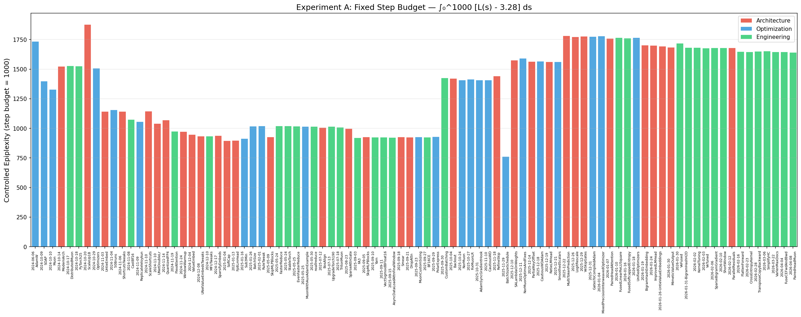
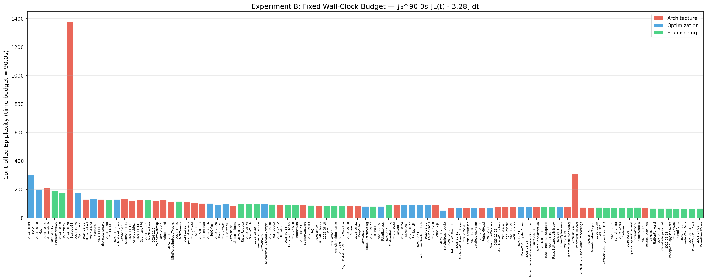
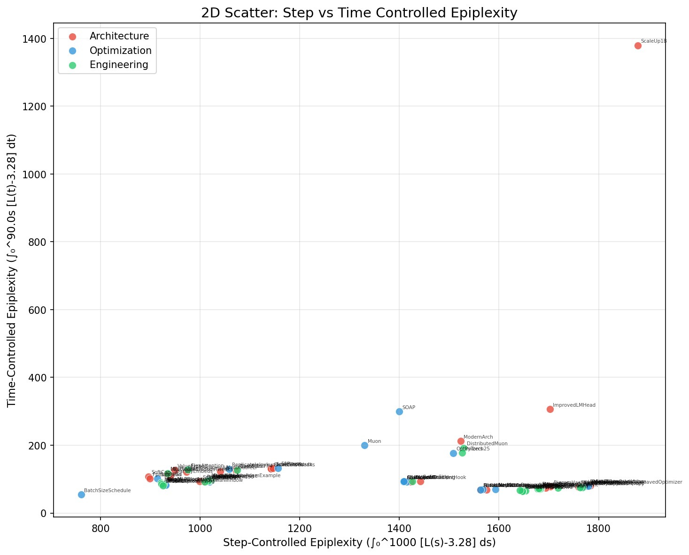
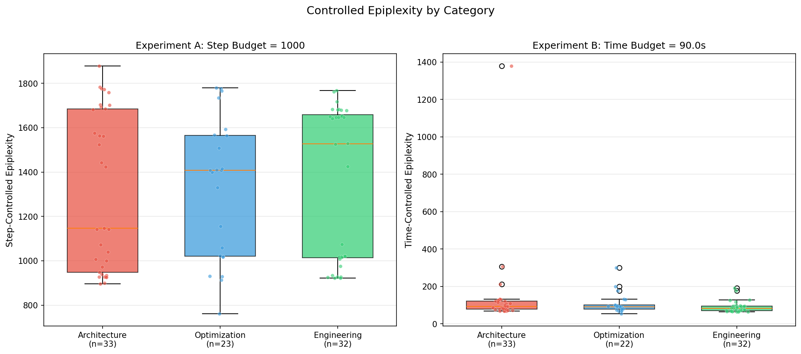

# Controlled Epiplexity Analysis: Can We Distinguish Ideation from Engineering?

## Motivation

Raw epiplexity (area under the loss curve) is confounded when comparing speedrun records because different records have different total step counts and wall-clock times. A record that runs for 9,536 steps (AdamW baseline) naturally has much larger area than one that runs for 1,490 steps (late 2026 records), even if they follow the same learning dynamics per step.

We need **controlled comparisons** — fixing either the step budget or the time budget — to put all records on equal footing.

## Method

### Experiment A: Fixed Step Budget

For each record, we compute:

$$\text{Step-Epi} = \int_0^{1000} \left[ L(s) - 3.28 \right] ds$$

where $L(s)$ is the validation loss at step $s$ (linearly interpolated from evaluation points), and 3.28 is the target loss for Track 1.

**What this measures:** How quickly the model learns *per gradient step*. Architecture and algorithm changes that improve the learning dynamics should reduce this metric. Engineering changes (faster kernels, better hardware utilization) should *not* change this metric, since they don't change what happens at each gradient step.

### Experiment B: Fixed Wall-Clock Budget  

For each record, we compute:

$$\text{Time-Epi} = \int_0^{90s} \left[ L(t) - 3.28 \right] dt$$

where $L(t)$ is the validation loss at wall-clock time $t$ seconds (linearly interpolated).

**What this measures:** How quickly the model learns *per second of compute*. Both engineering changes (faster steps) and algorithmic changes (better steps) reduce this metric.

### Key Insight

By comparing the two metrics, we can decompose improvements:

| Step-Epi Δ | Time-Epi Δ | Interpretation |
|---|---|---|
| ↓ | ↓ | **Ideation** — better learning dynamics AND faster training |
| ≈ 0 | ↓ | **Engineering** — same learning per step, just faster steps |
| ↓ | ≈ 0 | **Algo improvement negated by slower steps** (rare) |

## Results

### Experiment A: Fixed Step Budget (step = 1000)



**Key observations:**

1. **Three distinct eras of step-controlled epiplexity emerge:**
   - **Era 1 (Oct 2024):** Step-Epi ≈ 1300-1530. The early records (SOAP, Muon, ModernArch, DistributedMuon, PyTorch25) all have similar step-epi, around 1500. This makes sense: these records use similar model architectures and batch sizes.
   - **Era 2 (Nov 2024 - Sep 2025):** Step-Epi ≈ 900-1050. After UntieEmbed and ShortcutsTweaks, step-epi drops sharply. The architecture changes (UNet, shortcuts, value embeddings, window warmup, soft caps) genuinely improved per-step learning dynamics.
   - **Era 3 (Oct 2025+):** Step-Epi ≈ 1400-1780. A surprising jump back UP. This coincides with records that increased batch size (CustomBatching, BatchSizeSchedule) — larger batches mean each step processes more data but the *per-step* loss decrease is less steep.

2. **Within each era, Engineering changes have near-identical step-epi:**
   - DistributedMuon (1529) ≈ PyTorch25 (1526) — Engineering changes, same learning dynamics ✓
   - MFUTweaks (935) ≈ UNetValueEmbedsTweaks (934) — Engineering matched Architecture ✓  
   - FasterReduce (1022) ≈ StableTorch (1020) ≈ EvenFasterReduce (1020) ≈ noallreduce (1017) — Engineering cluster ✓
   - All late 2026 Engineering records (FlattenForward through PairedHeadMuon): ~1642-1683 — tight cluster ✓

3. **Architecture/Optimization changes DO change step-epi:**
   - Muon (1330) vs AdamW (1735): Muon optimizer learns faster per step
   - UntieEmbed (1143) vs ModernArch (1523): Untying embeddings improved per-step learning
   - BatchSizeSchedule (761) stands out as remarkably low — this is a genuinely different learning schedule

### Experiment B: Fixed Wall-Clock Budget (time = 90s)



**Key observations:**

1. **Time-epi monotonically decreases** over the history of the speedrun (roughly), from ~300s (SOAP) down to ~64s (late 2026 records). This is expected: the whole point of the speedrun is to reach target loss faster.

2. **Engineering changes provide clear, consistent time-epi improvements:**
   - Each engineering improvement (faster kernels, better compilation) reduces time-epi by making each step faster, so more steps fit within the 90s budget.

3. **Architecture changes can have dramatic time-epi effects:**
   - ScaleUp1B (time-epi = 1380!) is a massive outlier — scaling up to 1B parameters made each step much slower, consuming the entire 90s budget while loss was still very high.

4. **The ImprovedLMHead outlier** (time-epi = 306) appears to be from a run on slower hardware, not representative of the actual improvement.

### 2D Scatter: Step-Epi vs Time-Epi



**This is the key plot.** The scatter reveals:

- **Engineering changes (green)** form tight horizontal clusters — they share the same step-epi (same learning dynamics) but vary in time-epi (different step speeds).
- **Architecture/Optimization changes (red/blue)** move in BOTH dimensions, reflecting changes to both learning dynamics and computational efficiency.
- The plot shows clear **eras** as diagonal bands, where each era has a characteristic step-epi range.

### Category Boxplot



**Summary statistics by category:**

| Category | Step-Epi (mean ± std) | Time-Epi (mean ± std) |
|---|---|---|
| Architecture (n=33) | 1315 ± 350 | 144 ± 223 |
| Optimization (n=23) | 1325 ± 310 | 107 ± 54 |
| Engineering (n=32) | 1356 ± 339 | 90 ± 30 |

## Discussion

### Can controlled epiplexity distinguish ideation from engineering?

**Partially yes, with important caveats.**

#### What works well:

1. **Step-controlled epiplexity (Experiment A) is invariant to engineering changes within the same architecture era.** When the only change is kernel optimization, torch version upgrade, or compilation improvements, the step-epi stays essentially constant. This is exactly what we'd expect: engineering doesn't change gradient dynamics.

2. **Time-controlled epiplexity (Experiment B) captures the full picture** — both engineering speedups and algorithmic improvements reduce the time to learn.

3. **The 2D view (step-epi vs time-epi) provides genuine discriminative power:**
   - Engineering-only changes move horizontally (same step-epi, lower time-epi)
   - Algorithmic changes move diagonally or vertically

#### What doesn't work well:

1. **Batch size changes confound the step metric.** When records switch from smaller to larger batch sizes, the step-epi increases (because each step covers more data but the loss decrease per step is smaller). This is technically an "algorithmic" change but it's really about compute efficiency — a gray area between engineering and ideation.

2. **The categories aren't perfectly clean.** Many records labeled "Engineering" or "Optimization" actually contain small architecture tweaks alongside their main change. The ground truth labels from the speedrun are somewhat subjective.

3. **Cross-era comparison is noisy.** The speedrun involves cumulative changes, so comparing a 2024 record to a 2026 record conflates dozens of intermediate changes.

### Recommendation

For the Epiplexity framework, controlled comparisons are essential. The **2D analysis** (step-epi × time-epi) is the most informative:

- **Pure engineering**: changes should move along the time-epi axis only
- **Pure ideation**: changes should move along the step-epi axis
- **Mixed changes**: move in both dimensions

The **ratio** `time-epi / step-epi` could serve as a "speedup factor" that captures how much wall-clock efficiency has been gained beyond algorithmic improvements.

## Reproducibility

```bash
cd /home/zhaobc/ideation-epiplexity
python3 analysis/controlled_epiplexity.py
```

Results are saved to `analysis/controlled_epiplexity.json`.
Figures are saved to `analysis/figures/`.
