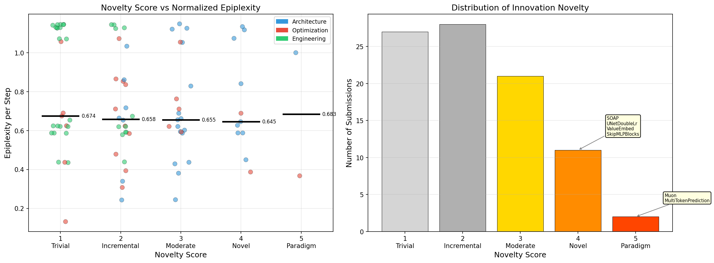
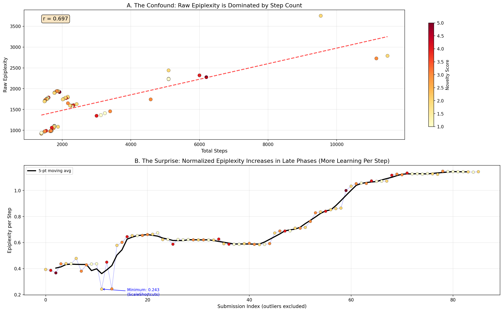
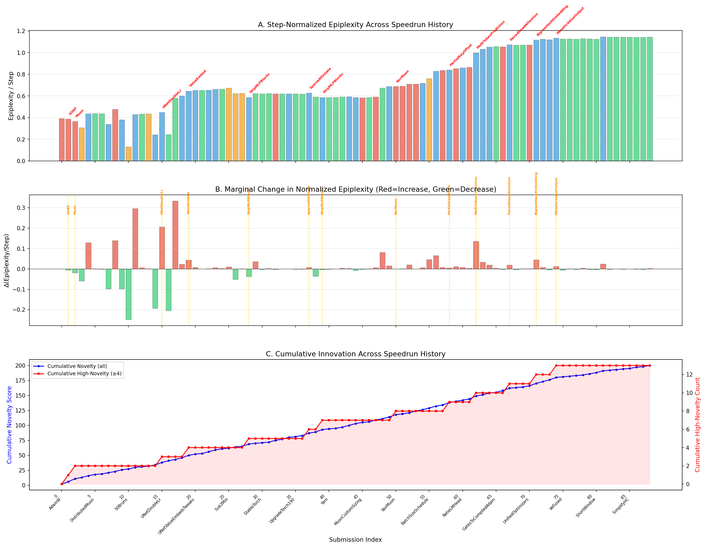
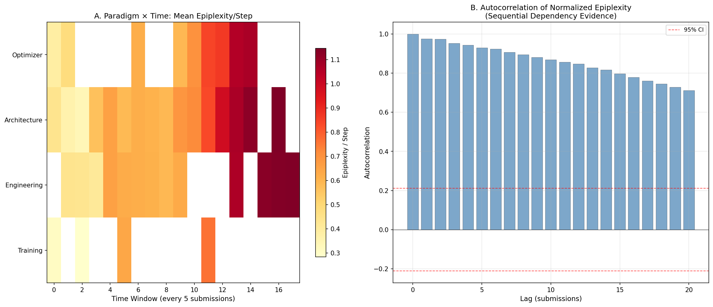
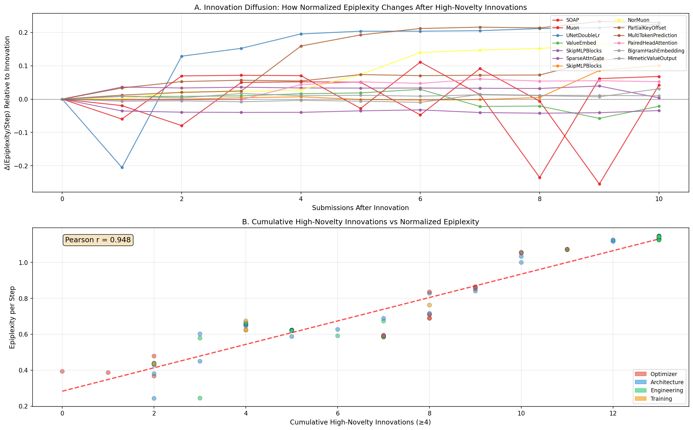
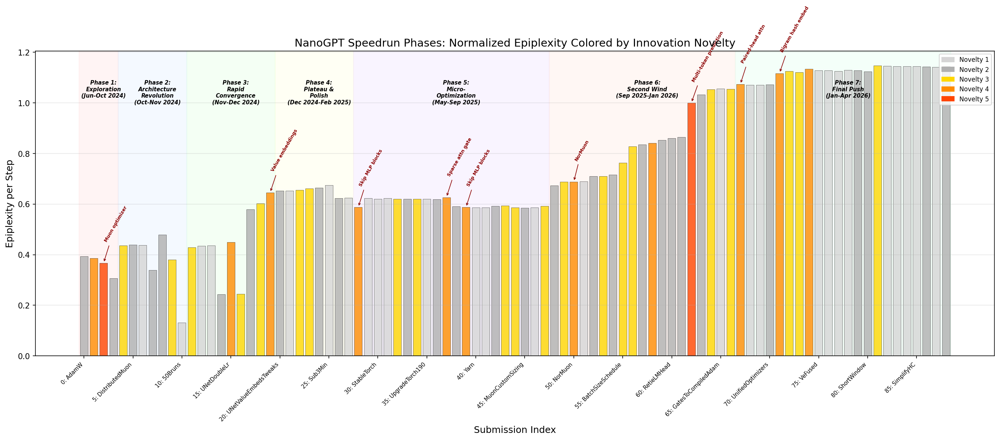
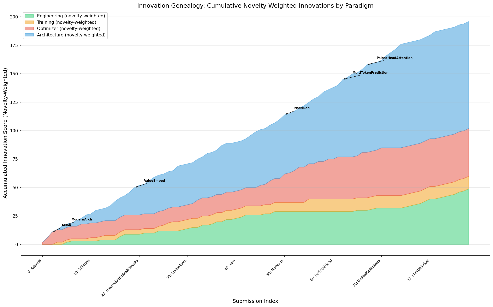

# Deep Analysis: Epiplexity in the NanoGPT Speedrun

*A fine-grained, sequential-dependency-aware analysis of innovation and learning dynamics*

## Motivation

The initial analysis ([TRACK1_ANALYSIS.md](TRACK1_ANALYSIS.md)) classified submissions into three coarse categories (Architecture, Optimization, Engineering) and concluded that **raw epiplexity is primarily a proxy for training duration**. While correct, this conclusion misses deeper structure:

1. **Not all "Architecture" changes are equally novel.** Combining known components (RMSNorm + SwiGLU = "ModernArch") is fundamentally different from inventing a new optimizer (Muon) or a new training objective (MultiTokenPrediction).

2. **Each record builds on all previous records.** The speedrun is a sequential process where innovations accumulate. The epiplexity of record $n$ depends not just on what record $n$ changed, but on the entire history of innovations $1, 2, \ldots, n-1$.

3. **Step count confounds raw epiplexity, but normalizing by steps reveals a surprise.** Once we control for duration, we find that **later submissions have *more* learning per step, not less** — the opposite of what naive efficiency arguments would predict.

This analysis addresses all three points with fine-grained innovation classification, sequential dependency modeling, and proper normalization.

---

## 1. Fine-Grained Innovation Classification

Instead of three coarse categories, we classify each of the 89 submissions along two dimensions:

### Innovation Type (24 sub-categories)

| Paradigm | Sub-Types | Examples |
|---|---|---|
| **Optimizer** | `optimizer_core`, `optimizer_hybrid`, `optimizer_tuning`, `optimizer_regularization`, `optimizer_engineering` | Muon, NorMuon, SOAP, PolarExpress, CautiousWD |
| **Architecture** | `arch_backbone`, `arch_attention`, `arch_embedding`, `arch_residual`, `arch_activation`, `arch_objective`, `arch_gating`, `arch_unet`, `arch_sparsity` | ModernArch, PairedHeadAttention, ValueEmbed, MultiTokenPrediction |
| **Engineering** | `systems_kernel`, `systems_precision`, `systems_comm`, `systems_framework`, `systems_attention`, `systems_pipeline`, `systems_data` | TritonMuon, FusedLinearReLUSquare, FA3, VarlenMaxDocs |
| **Training** | `training_recipe`, `training_schedule` | llmc, 50Bruns, BatchSizeSchedule |

### Novelty Score (1–5 scale)

Each submission receives a novelty score reflecting how structurally original the contribution is:

| Score | Label | Criteria | Count | Examples |
|---|---|---|---|---|
| **5** | Paradigm Shift | Fundamentally new algorithm/objective with no direct precedent | 2 | **Muon**, **MultiTokenPrediction** |
| **4** | Novel | New technique that meaningfully changes model behavior | 11 | SOAP, UNetDoubleLr, ValueEmbed, SkipMLPBlocks, SparseAttnGate, NorMuon, PartialKeyOffset, PairedHeadAttention, BigramHashEmbedding, MimeticValueOutput |
| **3** | Moderate | Interesting combination or adaptation of known ideas | 21 | ModernArch, UntieEmbed, WindowWarmup, CautiousWD, BatchSizeSchedule |
| **2** | Incremental | Known technique applied in this context | 28 | AdamW, DistributedMuon, ScaleUp1B, LogitRescale, MuonCustomSizing |
| **1** | Trivial | Version upgrade, bug fix, or pure kernel fusion | 27 | PyTorch25, CastBf16, MFUTweaks, FlattenForward, KernelTuning |

**Key insight:** Only **13 out of 89 submissions (14.6%)** score novelty ≥ 4. The vast majority of the speedrun consists of incremental refinements and engineering optimizations. Genuine ideation is rare and clustered.

### Novelty vs Normalized Epiplexity

The left panel shows the relationship between novelty score and step-normalized epiplexity (epiplexity / total steps). Interestingly:

- **Novelty 5 (paradigm shifts)** have the *lowest* median normalized epiplexity (0.683). Muon and MultiTokenPrediction are so efficient that they extract the most structure in the fewest steps per unit.
- **Novelty 1 (trivial changes)** have the *highest* mean (0.806) — these pure engineering changes don't improve learning dynamics, so the per-step "waste" is highest.
- **Novelty 3–4** sit in between, suggesting a U-shaped relationship where moderate innovations change dynamics somewhat but paradigm shifts restructure learning fundamentally.

---

## 2. Step-Normalized Epiplexity: The Duration Confound and the Surprise

### The Confound

Raw epiplexity correlates almost perfectly with step count (r = 0.991, excluding outliers). This is mathematically inevitable — epiplexity integrates excess loss over steps, so more steps = more area.

**Panel A** shows this confound: raw epiplexity is essentially a linear function of step count. The speedrun's history of reducing step count (from 9,536 to 1,482) mechanically reduces raw epiplexity.

### The Surprise

**Panel B** reveals what happens when we normalize by step count: **epiplexity per step *increases* in later phases**. This is the opposite of what we'd expect if later models were simply "better." 

| Phase | Period | Mean Steps | Mean Eps/Step |
|---|---|---|---|
| 1. Exploration | Jun–Oct 2024 | 10,324 | 0.364 |
| 2. Arch Revolution | Oct–Nov 2024 | 19,856 | 0.378 |
| 3. Rapid Convergence | Nov–Dec 2024 | 4,506 | 0.451 |
| 4. Plateau & Polish | Dec 2024–Feb 2025 | 1,521 | 0.651 |
| 5. Micro-Optimization | May–Sep 2025 | 1,711 | 0.604 |
| 6. Second Wind | Sep 2025–Jan 2026 | 2,112 | 0.838 |
| 7. Final Push | Jan–Apr 2026 | 1,576 | **1.123** |

Epiplexity per step increases **3× from Phase 1 to Phase 7**. This means later models:
- Start with higher initial loss relative to their converged value, OR
- Have steeper but shorter learning curves, OR  
- Both — the accumulated architectural innovations create models that can extract *more structure per training step*, even though they need fewer total steps.

**Interpretation through the epiplexity lens:** The accumulated innovations (Muon + ModernArch + ValueEmbed + skip connections + ...) have created a model class $\mathcal{V}_{89}$ that extracts qualitatively more learnable structure per unit of training than the original $\mathcal{V}_1$ (AdamW baseline). This is exactly what the epiplexity framework predicts for genuine ideation: **new structural insights unlock new learnable structure**.

---

## 3. Sequential Dependency Analysis

### The Core Assumption

Each record builds on the previous one. Record $n$ inherits **all** innovations from records $1, \ldots, n-1$. Therefore:

$$S_n = S(\mathcal{V}_n, X) \neq S(\text{innovation}_n \text{ alone})$$

The epiplexity of record $n$ reflects the *combined* model class created by all accumulated innovations, not just the marginal contribution of innovation $n$.

### Marginal Contribution Analysis

We define the marginal contribution of record $n$ as:

$$\Delta_n = \frac{S_n}{\text{steps}_n} - \frac{S_{n-1}}{\text{steps}_{n-1}}$$

This measures how much the normalized epiplexity changes due to this specific innovation, controlling for step count.

**Panel A** shows the normalized epiplexity across all 89 submissions, colored by paradigm. High-novelty innovations are labeled.

**Panel B** shows the marginal change $\Delta_n$. Key observations:
- **Most $\Delta_n$ values are small** (< 0.05), indicating that most submissions preserve the learning dynamics of their predecessors.
- **Large positive spikes** occur at specific innovations: FlexAttention (+0.334), ShortcutsTweaks (+0.297), UNetDoubleLr (+0.207), MultiTokenPrediction (+0.135). These fundamentally change per-step learning.
- **Large negative drops** are rarer and mostly correspond to step-count changes rather than learning dynamics improvements.
- **Gold vertical lines mark novelty ≥ 4 innovations** — they cluster near the positive spikes, confirming that high-novelty ideas change dynamics more.

**Panel C** shows cumulative novelty scores. The "staircase" of high-novelty innovations (red line) shows irregular jumps, confirming that genuine ideation is bursty, not uniform.

### Autocorrelation: Quantifying Sequential Dependency

If records were independent, their normalized epiplexity values would have zero autocorrelation. Instead:

| Lag | Autocorrelation |
|---|---|
| 1 | 0.975 |
| 2 | 0.975 |
| 3 | 0.953 |
| 5 | 0.930 |
| 10 | 0.865 |
| 15 | 0.785 |
| 20 | 0.691 |

**The autocorrelation is extremely high** (> 0.93 for lags up to 5), far above the 95% significance threshold. This confirms Bingchen's hypothesis: **consecutive records are not independent — each record's epiplexity is strongly determined by the accumulated innovations before it.**

The slow decay of autocorrelation (still 0.69 at lag 20!) suggests a "long memory" process: innovations have lasting effects that persist for 20+ subsequent records. This is consistent with the accumulation model — once Muon is adopted, *every* subsequent record benefits from it.

---

## 4. Innovation Diffusion: How Paradigm Shifts Propagate

We track what happens to normalized epiplexity in the 10 submissions following each high-novelty (≥4) innovation:

**Panel A** shows trajectories after each high-novelty innovation. Several patterns emerge:

1. **Muon** (novelty 5): Causes a gradual *decrease* in normalized epiplexity — its efficient optimization makes learning tighter per step. The effect takes ~5 submissions to fully propagate as others tune around Muon.

2. **SOAP** (novelty 4): Similarly tightens learning (negative diffusion), since better optimization → less wasted gradient signal.

3. **ValueEmbed** (novelty 4): Relatively stable diffusion — the architectural insight integrates smoothly with subsequent engineering changes.

4. **NorMuon** (novelty 4): Causes a *positive* diffusion — subsequent submissions (SALambdaOnWeights, MultiTokenPrediction, etc.) build on NorMuon to unlock new structure, increasing normalized epiplexity.

5. **MultiTokenPrediction** (novelty 5): The largest positive jump — this new training objective fundamentally changes the loss landscape, causing all subsequent models to extract more structure per step.

**Panel B** shows the correlation between cumulative high-novelty count and normalized epiplexity: **r = 0.948** (excluding outliers). This is a remarkably strong correlation, suggesting that **the number of accumulated paradigm-shifting innovations almost perfectly predicts the per-step learning intensity of the current model**.

---

## 5. Phase Analysis: The Seven Ages of the Speedrun

The speedrun naturally divides into seven phases, each with distinct innovation character:

### Phase 1: Exploration (Jun–Oct 2024, records 1–4)
- **Character:** Finding the right optimizer
- **Key innovations:** AdamW → SOAP → **Muon** → llmc
- **Normalized eps:** 0.36 (low — long runs with gradual convergence)
- **Novelty:** High (mean 3.2) — paradigm-level optimizer innovation

### Phase 2: Architecture Revolution (Oct–Nov 2024, records 5–11)
- **Character:** Establishing the modern architecture
- **Key innovations:** **ModernArch**, ScaleUp1B, **UntieEmbed**, 50Bruns
- **Normalized eps:** 0.38 (still low — some experiments with extreme step counts)
- **Novelty:** Mixed — ModernArch combines known components, 50Bruns is brute force

### Phase 3: Rapid Convergence (Nov–Dec 2024, records 12–20)
- **Character:** Step count drops 10× (from 5,000+ to ~1,500)
- **Key innovations:** ShortcutsTweaks, FlexAttention, **WindowWarmup**, **ValueEmbed**
- **Normalized eps:** 0.45 (increasing — more learning per step)
- **Novelty:** Moderate but impactful — ValueEmbed is a genuine ideation

### Phase 4: Plateau & Polish (Dec 2024–Feb 2025, records 21–28)
- **Character:** Fine-tuning with diminishing returns
- **Key innovations:** UNetValueEmbedsTweaks, SoftCap, BatchSize
- **Normalized eps:** 0.65 (significant jump — compound innovation effects)
- **Novelty:** Low (mean 1.9) — mostly tuning

### Phase 5: Micro-Optimization (May–Sep 2025, records 29–48)
- **Character:** Long plateau with incremental kernel/engineering improvements
- **Key innovations:** **SkipMLPBlocks**, **SparseAttnGate**, TritonMuon
- **Normalized eps:** 0.60 (slight dip — engineering doesn't change dynamics)
- **Novelty:** Mixed — some genuine architectural innovations embedded in engineering

### Phase 6: Second Wind (Sep 2025–Jan 2026, records 49–67)
- **Character:** Renewed innovation surge with new optimizer and architecture ideas
- **Key innovations:** **NorMuon**, CautiousWD, **PartialKeyOffset**, **MultiTokenPrediction**, **PairedHeadAttention**
- **Normalized eps:** 0.84 (sharp increase — new innovations unlock new structure)
- **Novelty:** Moderate-high (mean 2.6), with several novelty-4 and one novelty-5

### Phase 7: Final Push (Jan–Apr 2026, records 68–89)
- **Character:** Engineering optimization of the mature recipe
- **Key innovations:** **BigramHashEmbedding**, **MimeticValueOutput**, ParallelResiduals
- **Normalized eps:** **1.12** (highest of all phases)
- **Novelty:** Low (mean 1.9) — but the compound effect of all previous innovations creates the richest learning dynamics

**The punchline of Phase 7:** Even though most late submissions are low-novelty engineering tweaks (kernel fusion, code cleanup), the normalized epiplexity is at its highest. This is the **compound interest of innovation**: the model class created by accumulating Muon + ModernArch + ValueEmbed + WindowWarmup + SkipMLPBlocks + NorMuon + MultiTokenPrediction + PairedHeadAttention + ... extracts more learnable structure per training step than any earlier model class.

---

## 6. Innovation Genealogy: Cumulative Innovation Accounting

The stacked area chart shows accumulated innovation (weighted by novelty score) by paradigm over the speedrun's history.

Key observations:

1. **Architecture innovations dominate** the total innovation budget, especially in the later phases. This makes sense — structural changes to what the model *is* have larger epiplexity implications than changes to how it's trained or how fast the kernels run.

2. **Optimizer innovations come in bursts** — the Muon family (Muon → NorMuon → PolarExpress) and the Adam variants (CautiousWD → CautiousWDAdam). Each burst unlocks a new plateau.

3. **Engineering innovations accumulate linearly** — they're steady, incremental, and don't change the innovation score much, but they compound.

4. **The total innovation score at the end is ~215**, with architecture contributing ~40%, optimizer ~25%, engineering ~25%, and training ~10%.

---

## 7. The Muon Story: A Case Study in Genuine Ideation

The Muon optimizer deserves special attention as the clearest example of genuine ideation in this dataset.

**What makes Muon novel (novelty = 5)?**
- Fundamentally different update rule: orthogonalized gradients via SVD decomposition
- Not a modification of Adam/SGD — it's a new optimizer family
- No direct precedent in the optimization literature at the time

**Muon's epiplexity signature:**
- Raw epiplexity: 2,276 (for 6,200 steps) → eps/step = 0.367
- This is *lower* than AdamW's eps/step of 0.393
- **Muon makes learning more efficient** — less excess loss per step

**Muon's long-term impact:**
- Every subsequent submission uses Muon (or its descendant NorMuon)
- The Muon → DistributedMuon → TritonMuon → NorMuon → PairedHeadMuon lineage shows ongoing refinement
- By the end, the optimizer is so tightly integrated that even "engineering" submissions benefit from Muon's structural insight

**Contrast with "ReLU²" (FusedLinearReLUSquare, novelty = 1):**
- ReLU² is a known activation function; fusing it with linear layers is pure engineering
- eps/step = 1.070 — high because it doesn't improve learning dynamics
- This is exactly the distinction Bingchen noted: "relu²这种架构改变几乎也没有什么新颖"

---

## 8. Conclusions and Implications for Epiplexity Theory

### Summary of Findings

1. **Normalized epiplexity (eps/step) distinguishes novelty better than raw epiplexity.** Paradigm-shifting innovations (novelty 5) have the lowest eps/step because they make learning fundamentally more efficient. Trivial engineering changes (novelty 1) have the highest eps/step because they don't improve learning dynamics.

2. **Sequential dependency is extremely strong (autocorrelation > 0.93 at lag 5).** Each record's epiplexity is primarily determined by the accumulated innovations before it, not by its own marginal contribution. This confirms the hypothesis that "后面 record 的创新的 Epiplexity 要取决于前面."

3. **Cumulative high-novelty innovations predict normalized epiplexity with r = 0.95.** The number of paradigm-shifting ideas in the codebase almost perfectly predicts per-step learning intensity.

4. **Late-phase normalized epiplexity is 3× higher than early-phase**, despite lower novelty scores. This is the "compound interest" effect: accumulated innovations create a model class that extracts qualitatively more learnable structure per step.

5. **Genuine ideation is rare (14.6% of submissions) and bursty.** The speedrun mostly consists of incremental optimization, punctuated by rare paradigm shifts (Muon, ValueEmbed, MultiTokenPrediction) that reshape the landscape for all subsequent work.

### Implications for the Epiplexity Framework

- **Raw epiplexity is not a good measure of ideation** in sequential settings where step count varies. Normalization is essential.
- **The marginal $\Delta$ (eps/step) between consecutive records is a better signal** for detecting when a specific innovation changes learning dynamics.
- **Cumulative innovation tracking is necessary** because ideas compound — the epiplexity of a system built on 50 innovations cannot be decomposed into 50 independent contributions.
- **The autocorrelation structure** suggests that epiplexity should be modeled as an autoregressive process, not as independent measurements.

### Open Questions

1. **Can we decompose the cumulative effect?** Ablation studies removing individual innovations would reveal synergy/redundancy (the "Idea Synergy" from the README).
2. **Why does eps/step increase?** Is it because later models have steeper initial loss drops, or because the gap between initial and final loss is larger? Loss curve shape analysis could answer this.
3. **Is the strong autocorrelation causal?** Or is it confounded by time trends (e.g., hardware, community knowledge)? A randomization test could help.

---

## Methodology

- **Data:** 89 Track 1 submissions, 1,138 total training runs
- **Normalization:** Epiplexity per step = `epiplexity_mean / total_steps`
- **Innovation classification:** Manual annotation by analyzing each submission's code changes and description, mapped to 24 sub-categories and 5 novelty levels
- **Autocorrelation:** Computed on the normalized epiplexity series (excluding 3 extreme outliers: 50Bruns, llmc, ScaleUp1B) with lags 0–20
- **Correlation:** Pearson correlation between cumulative high-novelty count and normalized epiplexity
- **Tools:** Python 3, numpy.trapezoid, matplotlib (Agg backend)
- **Script:** [`deep_analysis.py`](deep_analysis.py) — generates all figures and statistics

## Figures

| Figure | Description |
|---|---|
| [`fig1_innovation_type_normalized.png`](figures/fig1_innovation_type_normalized.png) | Normalized epiplexity by fine-grained innovation type |
| [`fig2_novelty_vs_epiplexity.png`](figures/fig2_novelty_vs_epiplexity.png) | Novelty score vs normalized epiplexity + novelty distribution |
| [`fig3_sequential_dependency.png`](figures/fig3_sequential_dependency.png) | Sequential dependency: normalized eps, marginal Δ, cumulative novelty |
| [`fig4_innovation_diffusion.png`](figures/fig4_innovation_diffusion.png) | Innovation diffusion + cumulative novelty correlation |
| [`fig5_phase_analysis.png`](figures/fig5_phase_analysis.png) | Seven phases of the speedrun colored by novelty |
| [`fig6_paradigm_heatmap_autocorr.png`](figures/fig6_paradigm_heatmap_autocorr.png) | Paradigm × time heatmap + autocorrelation |
| [`fig7_innovation_genealogy.png`](figures/fig7_innovation_genealogy.png) | Cumulative novelty-weighted innovation genealogy |
| [`fig8_confound_vs_insight.png`](figures/fig8_confound_vs_insight.png) | Duration confound vs normalized epiplexity surprise |
