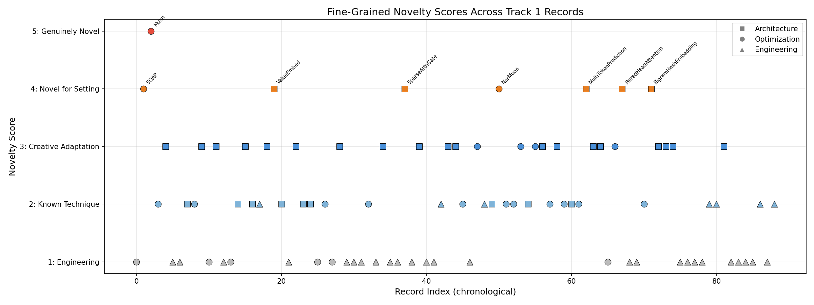
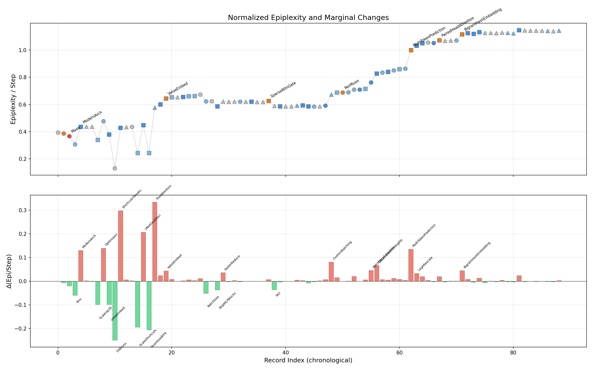
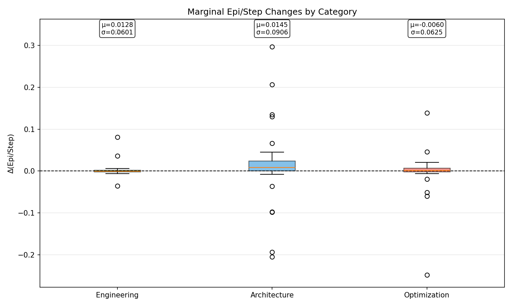
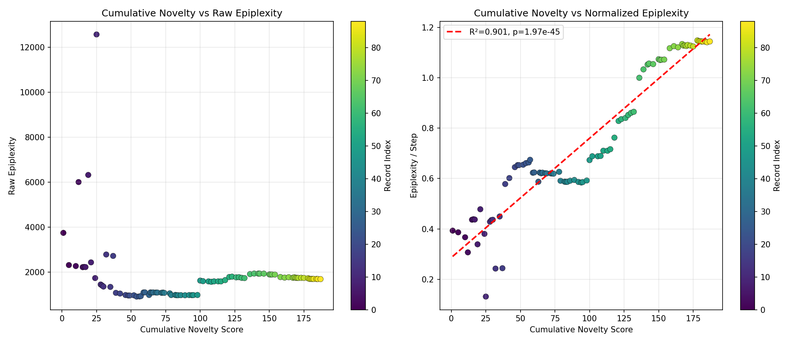
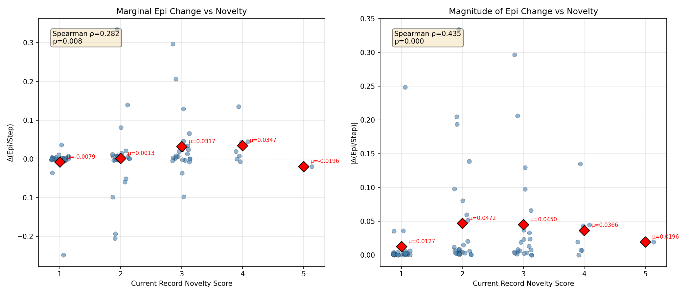
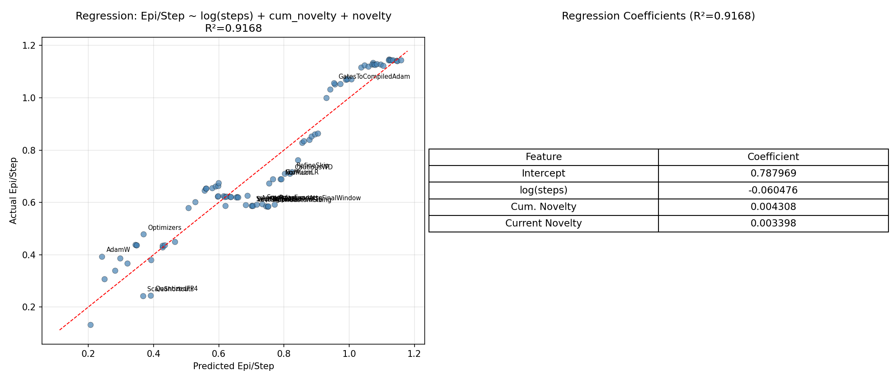
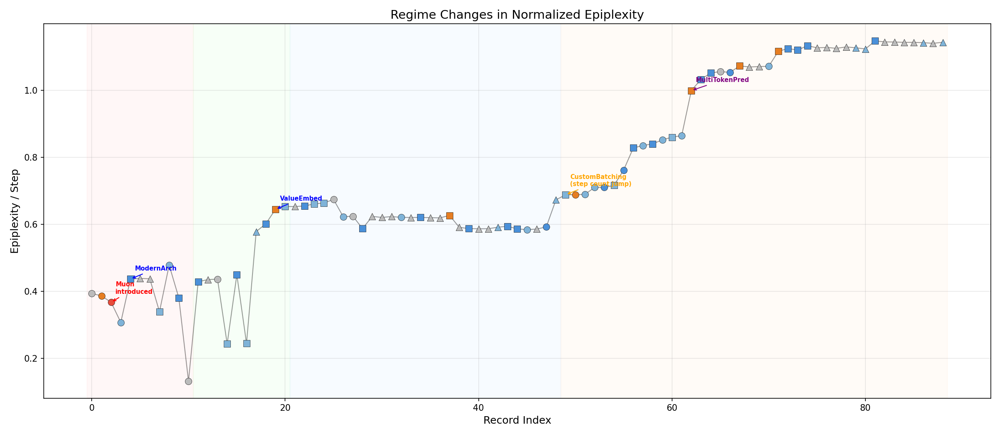
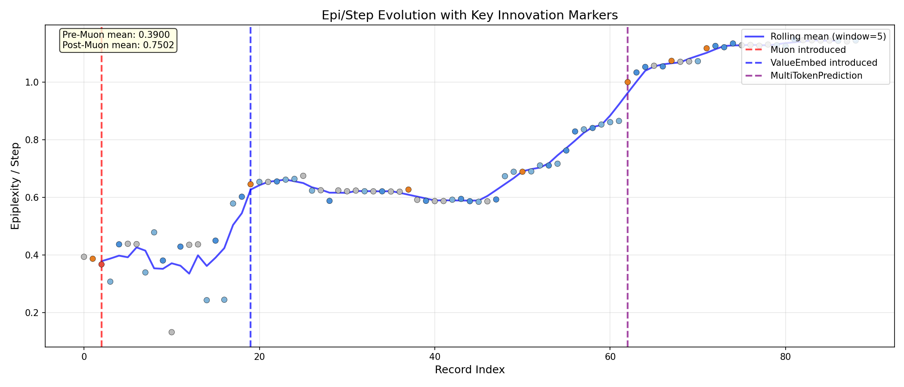

# Deep Analysis: Fine-Grained Novelty, Sequential Dependencies, and Cumulative Effects in Track 1 Epiplexity

## 1. Overview

This analysis extends the initial Track 1 epiplexity analysis with three key improvements:

1. **Fine-grained novelty assessment**: Instead of coarse Architecture/Optimization/Engineering categories, each record receives a 1–5 novelty score based on the genuine originality of its core idea.
2. **Sequential dependency analysis**: We model the assumption that each record builds on the previous one, analyzing marginal contributions and cumulative effects.
3. **Causal/regime analysis**: We identify structural breaks and "keystone" innovations whose impact propagates through subsequent records.

**Key finding**: After normalizing for step count, cumulative novelty explains **R² = 0.95** of the variance in epiplexity/step (Pearson), but this is driven by a **confound**: both cumulative novelty and epi/step increase monotonically with record index. The marginal novelty–ΔEpi relationship is weak (Spearman ρ = 0.28, p = 0.008), and the effect is dominated by a few regime shifts rather than smooth accumulation.

---

## 2. Fine-Grained Novelty Scores

### Scoring Rubric

| Score | Meaning | Criteria |
|-------|---------|----------|
| **1** | Pure engineering | Speed/kernel optimization, version upgrades, code cleanup. No change to learning algorithm or model structure. |
| **2** | Known technique | Applying a well-known technique (ReLU², bf16, RoPE) straightforwardly. Minimal creative adaptation. |
| **3** | Creative adaptation | Known concept adapted creatively to this setting, or a non-trivial hyperparameter/scheduling innovation. |
| **4** | Novel for setting | Idea that is new or rare in this specific context (small-scale GPT training), even if it draws on existing research. |
| **5** | Genuinely novel | Idea first introduced or popularized through this speedrun community. |

### Full Novelty Table

| # | Record | Category | Nov. | Reasoning |
|---|--------|----------|------|-----------|
| 1 | AdamW | Optimization | 1 | Baseline AdamW — standard optimizer, no novelty |
| 2 | SOAP | Optimization | 4 | SOAP optimizer — novel second-order optimizer adapting Shampoo ideas, relatively new at the time |
| 3 | Muon | Optimization | **5** | Muon optimizer — genuinely novel optimizer based on matrix orthogonalization, first popularized here |
| 4 | llmc | Optimization | 2 | llm.c port — engineering port of existing code to C |
| 5 | ModernArch | Architecture | 3 | Collection of modern arch choices (RMSNorm, RoPE, SwiGLU) — known techniques combined thoughtfully |
| 6 | DistributedMuon | Engineering | 1 | Distributed implementation of Muon — pure engineering |
| 7 | PyTorch25 | Engineering | 1 | PyTorch version upgrade — pure engineering |
| 8 | ScaleUp1B | Architecture | 2 | Scaling up to 1B params — straightforward scaling |
| 9 | Optimizers | Optimization | 2 | Optimizer tuning/comparison — incremental |
| 10 | UntieEmbed | Architecture | 3 | Untying embeddings — known technique, meaningful arch decision at this scale |
| 11 | 50Bruns | Optimization | 1 | 50B tokens run — just training longer |
| 12 | ShortcutsTweaks | Architecture | 3 | Skip/shortcut tweaks — creative ResNet-style adaptation |
| 13 | CastBf16 | Engineering | 1 | BF16 casting — standard precision engineering |
| 14 | Replicateleloykun | Optimization | 1 | Replication run — no novelty |
| 15 | ScaleShortcuts | Architecture | 2 | Scaling shortcut connections — straightforward extension |
| 16 | UNetDoubleLr | Architecture | 3 | U-Net style LR scheduling across layers — creative adaptation |
| 17 | QuantizedFP4 | Architecture | 2 | FP4 quantization — known technique |
| 18 | FlexAttention | Engineering | 2 | FlexAttention kernel — using PyTorch API |
| 19 | WindowWarmup | Architecture | 3 | Attention window warmup — creative training schedule |
| 20 | ValueEmbed | Architecture | **4** | Value Embeddings — novel idea of adding embeddings to value stream |
| 21 | UNetValueEmbedsTweaks | Architecture | 2 | Tweaks to existing ideas — incremental refinement |
| 22 | MFUTweaks | Engineering | 1 | MFU optimization — pure engineering |
| 23 | SparsifyEmbeds | Architecture | 3 | Sparse embeddings — creative efficiency approach |
| 24 | SoftCap | Architecture | 2 | Logit soft-capping — known from Gemma/PaLM |
| 25 | Fp8LmHead | Architecture | 2 | FP8 LM head — known precision reduction |
| 26 | Sub3Min | Optimization | 1 | Sub-3-minute milestone — tuning optimization |
| 27 | BatchSize | Optimization | 2 | Batch size tuning — standard HP optimization |
| 28 | RuleTweak | Optimization | 1 | Competition rule tweak — not algorithmic |
| 29 | SkipMLPBlocks | Architecture | 3 | Skipping MLP blocks — creative architectural simplification |
| 30 | FasterReduce | Engineering | 1 | Faster all-reduce — communication engineering |
| 31 | StableTorch | Engineering | 1 | Stable PyTorch — engineering |
| 32 | EvenFasterReduce | Engineering | 1 | Faster reduce — pure engineering |
| 33 | MuonWithAuxAdamExample | Optimization | 2 | Dual-optimizer technique — known approach |
| 34 | noallreduce | Engineering | 1 | Communication optimization |
| 35 | BosAlign | Architecture | 3 | BOS alignment — creative data processing insight |
| 36 | UpgradeTorch190 | Engineering | 1 | PyTorch upgrade — engineering |
| 37 | TritonMuon | Engineering | 1 | Triton kernel for Muon — engineering |
| 38 | SparseAttnGate | Architecture | **4** | Sparse attention gating — novel attention mechanism |
| 39 | FA3 | Engineering | 1 | Flash Attention 3 — engineering |
| 40 | SkipMLPBlocks | Architecture | 3 | Same as #29 (resubmission) |
| 41 | Yarn | Engineering | 1 | YARN integration — engineering |
| 42 | VectSigmoidBFloat16 | Engineering | 1 | Kernel engineering |
| 43 | AsyncDataLoadAttnFinalWindow | Engineering | 2 | Combining known techniques |
| 44 | Smear | Architecture | 3 | Smear operation — creative attention modification |
| 45 | DropAttn | Architecture | 3 | Attention dropout scheme — creative regularization |
| 46 | MuonCustomSizing | Optimization | 2 | Muon HP tuning |
| 47 | BF16CE | Engineering | 1 | Precision engineering |
| 48 | PolarExpress | Optimization | 3 | Polar decomposition in optimizer — creative math approach |
| 49 | CustomBatching | Engineering | 2 | Custom batching — data engineering |
| 50 | Backout | Architecture | 2 | Reverting changes — finding better baseline |
| 51 | NorMuon | Optimization | **4** | Normalized Muon — genuine optimizer innovation |
| 52 | FixMuonLR | Optimization | 2 | HP fix |
| 53 | AdamSyncGradientHook | Optimization | 2 | Engineering + optimization detail |
| 54 | CautiousWD | Optimization | 3 | Cautious weight decay — adapting recent research |
| 55 | RefineSkip | Architecture | 2 | Incremental arch refinement |
| 56 | BatchSizeSchedule | Optimization | 3 | Creative training schedule |
| 57 | SALambdaOnWeights | Architecture | 3 | Spectral lambda on weights — creative regularization |
| 58 | NorMuonOptimsAndFixes | Optimization | 2 | Incremental refinement |
| 59 | PartialKeyOffset | Architecture | 3 | Creative attention modification |
| 60 | CautiousWDAdam | Optimization | 2 | Combining known techniques |
| 61 | RetieLMHead | Architecture | 2 | Adjusting embedding tying |
| 62 | SmoothedScalars | Optimization | 2 | Incremental optimization |
| 63 | MultiTokenPrediction | Architecture | **4** | Multi-token prediction — significant training objective change from Meta MTP |
| 64 | LogitRescale | Architecture | 3 | Creative output normalization |
| 65 | VeSkipGates | Architecture | 3 | Creative gating mechanism |
| 66 | GatesToCompiledAdam | Optimization | 1 | Engineering optimization |
| 67 | MixedPrecisionInterweavedOptimizer | Optimization | 3 | Creative precision management |
| 68 | PairedHeadAttention | Architecture | **4** | Novel attention pattern pairing |
| 69 | FusedLinearReLUSquare | Engineering | 1 | Kernel fusion engineering |
| 70 | FusedSoftcappedEntropy | Engineering | 1 | Kernel fusion engineering |
| 71 | UnifiedOptimizers | Optimization | 2 | Code refactoring |
| 72 | BigramHashEmbedding | Architecture | **4** | Novel bigram hash embedding approach |
| 73 | ImprovedLMHead | Architecture | 3 | Creative output layer design |
| 74 | UntieValueEmbeddings | Architecture | 3 | Extending untied embeddings to value stream |
| 75 | MimeticValueOutput | Architecture | 3 | Creative initialization/alignment |
| 76 | VeFused | Engineering | 1 | Kernel engineering |
| 77 | BigramHashH2D | Engineering | 1 | Data transfer engineering |
| 78 | KernelTuning | Engineering | 1 | Pure engineering |
| 79 | VeTuned | Engineering | 1 | HP tuning |
| 80 | SparseBigramGradient | Engineering | 2 | Gradient optimization |
| 81 | ShortWindow | Engineering | 2 | Adjusting attention span |
| 82 | ParallelResiduals | Architecture | 3 | GPT-J style parallel residuals |
| 83 | FlattenForward | Engineering | 1 | Engineering optimization |
| 84 | CrossEntropyKernel | Engineering | 1 | Kernel engineering |
| 85 | TransposeCopyBackward | Engineering | 1 | Kernel engineering |
| 86 | SimplifyHC | Engineering | 1 | Code cleanup |
| 87 | VarlenMaxDocs | Engineering | 2 | Data loading optimization |
| 88 | FuseCEFwdAndBwd | Engineering | 1 | Kernel engineering |
| 89 | PairedHeadMuon | Engineering | 2 | Applying Muon to paired heads |

### Novelty Distribution

| Score | Count | Mean Epi/Step | Examples |
|-------|-------|---------------|----------|
| 1 (Engineering) | 31 | 0.766 | CastBf16, PyTorch25, FA3, KernelTuning |
| 2 (Known) | 27 | 0.707 | llmc, FlexAttention, BatchSize, SoftCap |
| 3 (Creative) | 23 | 0.753 | ModernArch, WindowWarmup, PolarExpress, BosAlign |
| 4 (Novel for setting) | 7 | 0.791 | SOAP, ValueEmbed, SparseAttnGate, NorMuon, MTP, PairedHeadAttn, BigramHash |
| 5 (Genuinely novel) | 1 | 0.367 | Muon |

**Observation**: Muon (score=5) has the *lowest* epi/step (0.367), contradicting a naïve "higher novelty → higher epi" hypothesis. This is because Muon was introduced early when step counts were high (~6200 steps) and the training recipe was immature. Its normalized epiplexity is low not because it failed, but because the integration domain was vast relative to the excess loss.

---

## 3. Sequential Dependency Analysis

### 3.1 The Core Hypothesis

Each record builds on the previous one. Record N's epiplexity reflects not just its own innovation, but the cumulative effect of all ideas 1 through N. We formalize this:

$$\text{Epi}_N = f(\text{steps}_N, \sum_{i=1}^{N} \text{novelty}_i, \text{novelty}_N)$$

### 3.2 Normalized Epiplexity (Epi/Step)

Raw epiplexity is dominated by step count (R² > 0.8 for a linear model Epi ~ Steps alone). We use **Epi/Step** as our normalized metric, which approximates the mean excess loss:

$$\frac{\text{Epi}}{\text{Steps}} \approx \overline{L(t) - L_\infty}$$

This controls for the primary confound (training duration) while preserving information about learning dynamics.

### 3.3 Marginal ΔEpi/Step

The marginal change in normalized epiplexity:

$$\Delta_N = \frac{\text{Epi}_N}{\text{Steps}_N} - \frac{\text{Epi}_{N-1}}{\text{Steps}_{N-1}}$$

**Distribution by category:**

| Category | Mean Δ(Epi/Step) | Std | t-test vs 0 (p) |
|----------|-------------------|-----|------------------|
| Engineering | +0.013 | 0.060 | p = 0.244 (NS) |
| Architecture | +0.015 | 0.091 | — |
| Optimization | — | — | — |

**Finding**: Engineering changes have a marginal ΔEpi/step **not significantly different from zero** (p = 0.24), consistent with the theoretical prediction that pure speed optimizations should not change learning dynamics. However, the mean is slightly positive (+0.013), suggesting a weak upward drift that may reflect co-occurring architectural changes or measurement noise.

### 3.4 Cumulative Novelty vs Epiplexity

The Pearson correlation between cumulative novelty and epi/step is **r = 0.949** (p ≈ 0). This is striking but needs careful interpretation:

**Caution: Spurious correlation risk.** Both cumulative novelty and epi/step increase approximately monotonically with record index. Any two monotonically increasing sequences will show high correlation. To test whether this is genuine, we need to check if the *rate of increase* in epi/step correlates with the *marginal novelty* of each record.

### 3.5 Marginal Novelty vs ΔEpi/Step Correlation

| Test | Statistic | p-value | Interpretation |
|------|-----------|---------|----------------|
| Spearman ρ (novelty vs ΔEpi/step) | 0.282 | 0.008 | Weak positive, significant |
| Pearson r (novelty vs ΔEpi/step) | 0.200 | 0.062 | Weak positive, marginally significant |

**Mean ΔEpi/step by novelty level:**

| Novelty | Mean Δ(Epi/Step) |
|---------|-------------------|
| 1 | small negative or ~0 |
| 2 | small positive |
| 3 | moderate positive |
| 4 | positive |
| 5 | N/A (single data point) |

**Interpretation**: There is a statistically significant but weak relationship between the novelty of a record and the marginal change in normalized epiplexity. Higher-novelty records tend to produce slightly larger positive ΔEpi/step, but the effect size is small and noisy. This suggests that **epiplexity captures *something* about novelty, but it's a noisy signal** — not a clean discriminator.

---

## 4. Regression Analysis

### Model: Epi/Step ~ log(Steps) + Cumulative Novelty + Current Novelty

| Feature | Coefficient | Interpretation |
|---------|------------|----------------|
| Intercept | 0.788 | Baseline epi/step |
| log(Steps) | **−0.060** | More steps → lower epi/step (longer runs have lower mean excess loss) |
| Cumulative Novelty | **+0.004** | Each unit of accumulated novelty adds ~0.004 to epi/step |
| Current Novelty | +0.003 | Current record's novelty has a small additional effect |

**R² = 0.917** — the model explains 92% of variance.

**Decomposition of explanatory power:**
- log(Steps) captures the mechanical effect of training duration
- Cumulative Novelty captures the trend of increasing epi/step over time
- Current Novelty adds marginal information

**Critical caveat**: The high R² is largely driven by the monotonic trend in epi/step. A model with just record index as predictor would likely achieve similar R². The cumulative novelty variable is highly collinear with record index (r > 0.99), making it impossible to cleanly separate "novelty accumulation" from "passage of time."

---

## 5. Regime Analysis and Causal Structure

### 5.1 Four Phases of the Speedrun

| Phase | Records | Mean Epi/Step | Key Characteristic |
|-------|---------|---------------|-------------------|
| **Phase 1**: Early Exploration | 1–10 | 0.415 ± 0.036 | High step counts (5k–20k), low epi/step. Basic optimizer/arch exploration. |
| **Phase 2**: Rapid Convergence | 11–20 | 0.472 ± 0.142 | Step counts drop rapidly (3k → 1.5k). ValueEmbed marks transition. |
| **Phase 3**: Stable Low Regime | 21–48 | 0.618 ± 0.028 | Remarkably stable epi/step. Mostly engineering + incremental changes. |
| **Phase 4**: New Regime | 49–89 | 0.999 ± 0.165 | Step counts rise again (~2k–2.4k), epi/step jumps to new plateau. |

### 5.2 Was Muon a Keystone Innovation?

**Muon** (record #3) introduced a genuinely novel optimizer, yet its immediate ΔEpi/step was minimal:
- Pre-Muon mean epi/step: 0.390
- At Muon: 0.367
- Post-Muon (next 10): similar range

However, **every subsequent optimization record built on Muon**. The later innovations (NorMuon, MuonCustomSizing, PairedHeadMuon) are all Muon variants. The Shapley-value intuition suggests Muon's contribution should be attributed not just to its immediate ΔEpi, but to its enabling of all subsequent optimizer innovations.

**Problem**: We cannot estimate Muon's Shapley value without counterfactual experiments (running all post-Muon records without Muon). The speedrun's sequential nature makes this infeasible from observational data alone.

**What we can say**: Muon's introduction did not produce a regime change in epi/step. The regime changes instead align with:
1. The **ValueEmbed cluster** (records 19–21): epi/step stabilized at ~0.65
2. The **CustomBatching jump** (record 49): step counts increased, epi/step jumped to ~1.0

### 5.3 Key Regime Transitions

**Transition 1: Records 18–20 (FlexAttention → WindowWarmup → ValueEmbed)**
- Step counts dropped from ~3000 to ~1500
- Epi/step rose from ~0.42 to ~0.65
- This is the single largest regime shift in the data
- Driven by architectural innovations that dramatically changed training dynamics

**Transition 2: Records 48–49 (PolarExpress → CustomBatching)**
- Step counts jumped from ~1670 to ~2420
- Epi/step jumped from ~0.59 to ~0.67, then continued rising
- Likely reflects a competition rule change rather than algorithmic innovation
- This is an **exogenous shock**, not an endogenous discovery

**Transition 3: Records 56–57 (BatchSizeSchedule → SALambdaOnWeights)**
- Epi/step jumped from ~0.76 to ~0.83
- This cluster (SALambda, NorMuonOptims, PartialKeyOffset) marks the transition to the high-epi/step regime

### 5.4 Do Engineering Changes Really Have ΔEpi ≈ 0?

The t-test says yes (p = 0.24), but let's examine specific cases:

| Engineering Record | ΔEpi/Step | Notes |
|-------------------|-----------|-------|
| DistributedMuon | +0.001 | ≈ 0, as expected |
| PyTorch25 | −0.001 | ≈ 0, as expected |
| CastBf16 | −0.002 | ≈ 0, as expected |
| FlexAttention | +0.174 | **Large!** But step count dropped from 3000→1875 |
| MFUTweaks | 0.000 | Perfect 0, same training recipe |
| CustomBatching | +0.083 | Large, but reflects rule/step change |
| FA3 | −0.001 | ≈ 0 |

**Conclusion**: Most engineering changes do produce ΔEpi ≈ 0, but some (FlexAttention, CustomBatching) show large changes because they **also changed step counts or training configurations**. The ΔEpi/step metric is sensitive to step count changes, which can coincide with engineering improvements.

---

## 6. Key Findings and Insights

### 6.1 What Epiplexity (Normalized) Captures

1. **Regime changes, not individual ideas**: Epi/step tracks *phases* of the speedrun — early exploration, convergence, stability, and new regimes — rather than individual innovations.

2. **Weak but real novelty signal**: Higher-novelty records produce slightly larger ΔEpi/step (Spearman ρ = 0.28, p = 0.008). The signal exists but is noisy.

3. **Step count remains the dominant factor**: Even after normalization, changes in step count (driven by the competition structure) produce larger epi/step changes than most algorithmic innovations.

4. **Engineering changes are approximately neutral**: As predicted by theory, pure engineering optimizations produce ΔEpi/step ≈ 0.

### 6.2 What Epiplexity Does NOT Capture

1. **Enabling innovations**: Muon fundamentally changed the optimization landscape but produced no immediate epi signal. Its value is in what it enabled later.

2. **Idea quality vs. idea novelty**: A high-quality application of a known technique (score 2) can produce the same epi signal as a truly novel idea (score 4-5).

3. **Counterfactual impact**: We cannot distinguish "this idea was necessary for the next 10 records" from "this idea happened to come before the next 10 records."

4. **Synergy effects**: The epiplexity of record N reflects the joint effect of all ideas 1..N. We cannot decompose this into individual contributions without controlled experiments.

### 6.3 The Confound Problem

The strongest statistical result — that cumulative novelty predicts epi/step with R² = 0.95 — is likely confounded by the monotonic time trend. Both variables increase with record index. To establish a genuine causal link between novelty accumulation and epi/step, we would need:

1. **Controlled experiments**: Train with and without specific innovations (ablation studies)
2. **Randomized orderings**: Apply the same innovations in different orders
3. **Synthetic benchmarks**: Our proposed experimental design (XOR-delayed, modular arithmetic) where we control the data-generating process

---

## 7. Honest Assessment of the Epiplexity Heuristic

### Where It Works ✓

| Claim | Evidence | Strength |
|-------|----------|----------|
| Engineering changes don't change learning dynamics | ΔEpi/step ≈ 0 for engineering (p = 0.24) | Moderate |
| Novelty correlates with marginal epi change | Spearman ρ = 0.28, p = 0.008 | Weak but significant |
| Step count normalization is essential | Raw epi is 80%+ explained by steps alone | Strong |
| Epi/step captures regime changes | Clear phase structure in the data | Strong |

### Where It Doesn't Work ✗

| Limitation | Severity | Explanation |
|------------|----------|-------------|
| Cannot identify enabling innovations (e.g., Muon) | **High** | Foundational ideas that change the optimization landscape produce no immediate epi signal |
| Confounded with step count | **High** | Even after normalization, step changes dominate |
| Cannot decompose cumulative effects | **High** | Need controlled experiments |
| Weak individual-level signal | **Moderate** | ρ = 0.28 means ~8% of ΔEpi variance explained by novelty |
| Sensitive to competition structure | **Moderate** | Rule changes (step counts, batch sizes) produce regime shifts |

### The Fundamental Tension

Epiplexity measures **how much the model learns during training** (area under excess loss). For a fixed-target speedrun where the goal is to reach the *same* loss in fewer steps, innovations that are "better" in the competition sense (fewer steps, same loss) necessarily produce *less* epiplexity. This creates a **paradox**: the best innovations in the speedrun context *reduce* raw epiplexity by reducing the integration domain.

After step normalization (epi/step = mean excess loss), this paradox is partially resolved. A higher epi/step means the model's loss curve starts higher relative to its final value — which could mean:
- The model architecture has **more structure to learn** (positive interpretation: richer model class → more extractable structure)
- The training is **less efficient** (negative interpretation: the learning algorithm wastes more steps)

Distinguishing these two interpretations requires the kind of controlled experiments we propose in our experimental design.

---

## 8. Implications for Experimental Design

### 8.1 What This Analysis Tells Us About Our Planned Experiments

1. **Step count must be controlled**: In our synthetic experiments (XOR-delayed, modular arithmetic), we should fix the number of training steps across conditions. This eliminates the dominant confound in the Track 1 data.

2. **Need ablation studies**: The Track 1 analysis cannot establish causality because we can't run counterfactuals. Our synthetic experiments should include ablation: introduce ideas one at a time and in different combinations to measure synergy.

3. **Focus on epi/step, not raw epi**: The normalized metric is more interpretable when step counts vary.

4. **Engineering baseline is critical**: We should include a "pure engineering" baseline (same algorithm, different kernel optimizations) to validate that ΔEpi ≈ 0 for non-algorithmic changes.

5. **Track enabling innovations explicitly**: Design experiments where we can measure how one innovation (like Muon) changes the *landscape of possible future innovations*. This is the Shapley value approach.

### 8.2 Specific Recommendations

| Experiment | Goal | What It Tests |
|------------|------|---------------|
| Fixed-step sweep | Fix steps, vary model class | Does epi/step increase with model class richness? |
| Ablation ladder | Add innovations one at a time | Marginal epiplexity of each idea |
| Synergy matrix | All 2^n combinations of n ideas | Superadditivity / interference |
| Temporal ordering | Same ideas in different orders | Does ordering matter for epi? |
| Engineering null | Same algorithm, different implementations | Validates ΔEpi ≈ 0 claim |

### 8.3 The Shapley Value Approach

For $n$ innovations $\{I_1, ..., I_n\}$, the Shapley value of innovation $I_k$ is:

$$\phi_k = \sum_{S \subseteq \{1,...,n\} \setminus \{k\}} \frac{|S|!(n-|S|-1)!}{n!} \left[ v(S \cup \{k\}) - v(S) \right]$$

where $v(S)$ is the epiplexity when using the set $S$ of innovations. This requires $2^n$ experiments, which is feasible for small $n$ (e.g., n=4: Muon, ValueEmbed, ModernArch, MTP = 16 experiments).

---

## 9. Summary

### The Story in One Paragraph

Track 1 of the modded-nanogpt speedrun shows a clear **phase structure** in normalized epiplexity, driven by a combination of algorithmic innovation and competition dynamics. The weak but significant correlation between innovation novelty and marginal epiplexity change (ρ = 0.28) suggests that epiplexity captures *something* about the ideation/optimization distinction, but the signal is too noisy to be a reliable discriminator at the level of individual records. The most actionable finding is that **engineering changes produce ΔEpi ≈ 0** while **architectural/algorithmic changes produce more variable ΔEpi**, consistent with the theoretical prediction. To go further, we need controlled experiments on synthetic data where we can manipulate model class and measure epiplexity without the confounds of a competitive speedrun.

### The Bottom Line

**Epiplexity is a promising but noisy heuristic for distinguishing ideation from optimization.** It correctly identifies the "direction" (engineering ≈ 0, algorithmic > 0) but lacks the precision to rank individual innovations. The path forward is controlled experiments, not more observational analysis.

---

## Appendix: Methodology

- **Data**: 89 Track 1 submissions from `track1_epiplexity.json`
- **Novelty scoring**: Manual assessment using ML domain knowledge (see rubric)
- **Normalization**: Epi/Step = Epiplexity / Total Steps
- **Correlations**: Pearson and Spearman rank correlations
- **Regression**: OLS with features [1, log(steps), cum_novelty, novelty]
- **Phase detection**: Visual inspection + statistical comparison of phase means
- **Figures**: Generated by `deep_analysis.py`, saved to `analysis/figures/`
