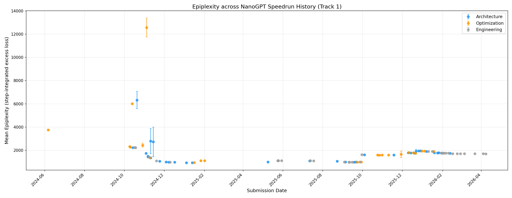
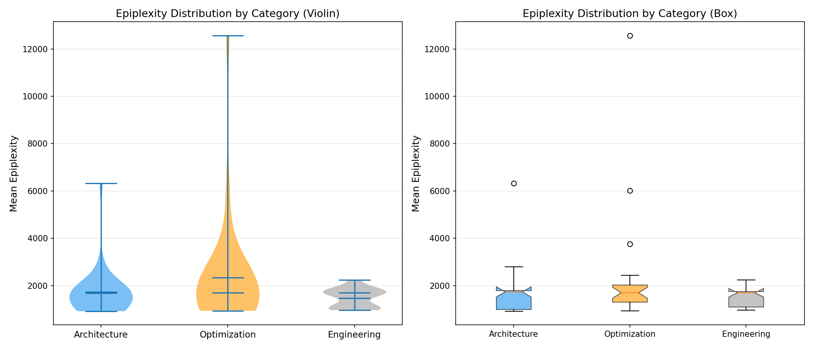
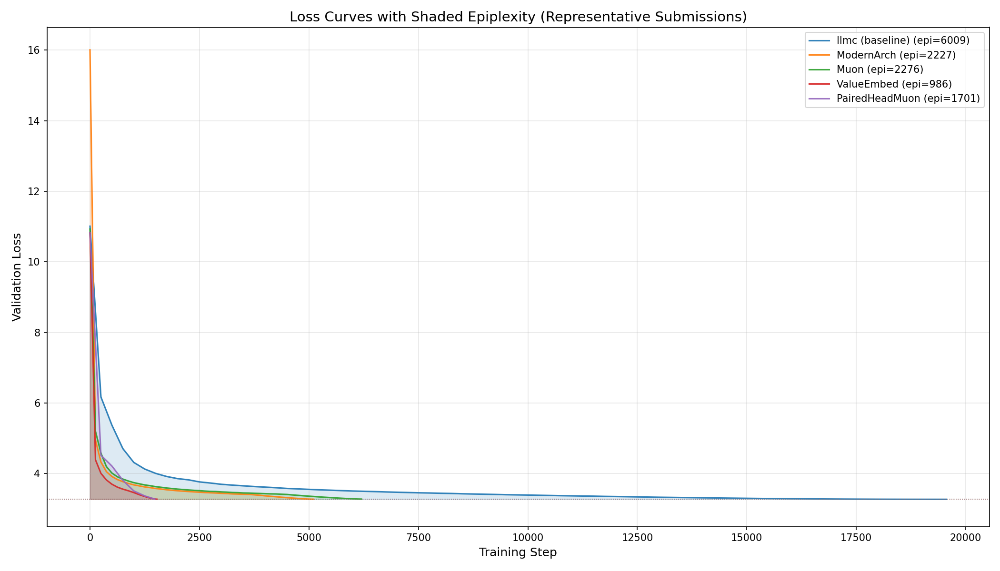

# Track 1 Epiplexity Analysis: NanoGPT Main Speedrun

## What is Epiplexity?

**Epiplexity** measures the total "excess loss" a training run accumulates above its final converged value. Formally:

$$S = \int_0^T [L(t) - L_\infty] \, dt$$

where $L(t)$ is the validation loss at step $t$ and $L_\infty$ is the final validation loss. We compute this using the trapezoidal rule over step number (not wall-clock time).

Intuitively, epiplexity captures **how much learning happened during training** — a run that starts with very high loss and takes many steps to converge will have high epiplexity, while a run that converges quickly will have low epiplexity. It's the area between the loss curve and the final loss line.

## Why Track 1?

Track 1 is the main modded-nanogpt speedrun — a community competition to train GPT-2 (124M) to a target validation loss as fast as possible on a single 8×H100 node. Over 89 submissions from June 2024 to April 2026, contributors submitted improvements in three categories:

1. **Architecture** — changes to model structure (e.g., ModernArch, ValueEmbed, PairedHeadAttention)
2. **Optimization** — changes to the optimizer or training procedure (e.g., Muon, NorMuon, BatchSize)
3. **Engineering** — systems/kernel optimizations that don't change the algorithm (e.g., FlexAttention, TritonMuon, FusedLinearReLUSquare)

Each submission iteratively improved on the previous record, reducing training time from ~45 minutes (AdamW baseline) to under 3 minutes.

## Results

### Epiplexity Timeline

The timeline shows a clear trend: **epiplexity decreases dramatically over the speedrun's history**. Early submissions (2024) used many more training steps and had epiplexity values of 2000–6000+, while later submissions (2025–2026) converged around 900–2000. This reflects the speedrun's core dynamic: each improvement either reduces the number of steps needed (reducing epiplexity by shrinking the integration domain) or makes learning more efficient (reducing epiplexity by lowering the excess loss curve).

Notable outliers:
- **50Bruns** (12,570): An optimization submission with 95,367 steps — massively more than other submissions
- **llmc** (6,009): The early llmc baseline trained for 19,560 steps
- **ScaleUp1B** (6,325): A scale-up experiment with ~18,648 steps

### Epiplexity by Category

| Category | N | Mean | Median | Std |
|---|---|---|---|---|
| Architecture | 33 | 1,684 | 1,733 | 959 |
| Optimization | 24 | 2,336 | 1,696 | 2,376 |
| Engineering | 32 | 1,478 | 1,697 | 389 |

Key observations:
- **Optimization** has the highest mean epiplexity but also the highest variance — driven by early submissions (AdamW, llmc, 50Bruns) that used many more training steps
- **Architecture** has moderate mean epiplexity with a long right tail (ScaleUp1B, ScaleShortcuts, QuantizedFP4)
- **Engineering** has the lowest and most consistent epiplexity — these submissions typically keep the same training recipe and just speed up the kernels
- Medians are remarkably similar across categories (~1,700), suggesting that **once you control for total step count, the categories produce similar learning dynamics**

### Representative Loss Curves

This overlay demonstrates the visual meaning of epiplexity — the shaded area between each loss curve and its final value. Notable patterns:
- **llmc** (blue) takes the longest to converge and has the largest shaded area
- **ModernArch** and **Muon** have similar total areas but achieve lower loss faster
- **ValueEmbed** converges extremely quickly in ~1,500 steps with minimal excess area
- **PairedHeadMuon** (the latest submission shown) trains for only ~1,480 steps but starts with higher epiplexity per step due to architectural complexity

## Full Submission Table

| # | Date | Submission | Category | Runs | Steps | Epiplexity | ± | Final Loss |
|---|---|---|---|---|---|---|---|---|
| 1 | 2024-06-06 | AdamW | Optimization | 1 | 9,536 | 3,750.8 | 0.0 | 3.2760 |
| 2 | 2024-10-09 | SOAP | Optimization | 1 | 6,000 | 2,319.9 | 0.0 | 3.2763 |
| 3 | 2024-10-10 | Muon | Optimization | 1 | 6,200 | 2,276.0 | 0.0 | 3.2785 |
| 4 | 2024-10-13 | llmc | Optimization | 1 | 19,560 | 6,008.9 | 0.0 | 3.2722 |
| 5 | 2024-10-14 | ModernArch | Architecture | 1 | 5,100 | 2,227.1 | 0.0 | 3.2741 |
| 6 | 2024-10-17 | DistributedMuon | Engineering | 1 | 5,100 | 2,236.7 | 0.0 | 3.2747 |
| 7 | 2024-10-18 | PyTorch25 | Engineering | 1 | 5,100 | 2,230.9 | 0.0 | 3.2755 |
| 8 | 2024-10-20 | ScaleUp1B | Architecture | 3 | 18,648 | 6,324.7 | 739.6 | 2.7569 |
| 9 | 2024-10-29 | Optimizers | Optimization | 4 | 5,100 | 2,439.0 | 169.2 | 3.2944 |
| 10 | 2024-11-03 | UntieEmbed | Architecture | 1 | 4,578 | 1,741.8 | 0.0 | 3.2762 |
| 11 | 2024-11-04 | 50Bruns | Optimization | 4 | 95,367 | 12,569.5 | 815.9 | 3.0644 |
| 12 | 2024-11-06 | ShortcutsTweaks | Architecture | 7 | 3,396 | 1,455.9 | 117.5 | 3.2980 |
| 13 | 2024-11-08 | CastBf16 | Engineering | 1 | 3,242 | 1,410.3 | 0.0 | 3.2781 |
| 14 | 2024-11-09 | Replicateleloykun | Optimization | 1 | 3,125 | 1,364.1 | 0.0 | 3.2824 |
| 15 | 2024-11-10 | ScaleShortcuts | Architecture | 5 | 11,482 | 2,788.9 | 1,083.6 | 3.1834 |
| 16 | 2024-11-10 | UNetDoubleLr | Architecture | 1 | 3,000 | 1,348.6 | 0.0 | 3.2753 |
| 17 | 2024-11-14 | QuantizedFP4 | Architecture | 4 | 11,157 | 2,726.5 | 1,276.1 | 3.1713 |
| 18 | 2024-11-19 | FlexAttention | Engineering | 1 | 1,875 | 1,084.3 | 0.0 | 3.2783 |
| 19 | 2024-11-24 | WindowWarmup | Architecture | 7 | 1,750 | 1,053.3 | 3.0 | 3.2770 |
| 20 | 2024-12-04 | ValueEmbed | Architecture | 38 | 1,530 | 987.0 | 3.0 | 3.2776 |
| 21 | 2024-12-08 | UNetValueEmbedsTweaks | Architecture | 75 | 1,480 | 966.8 | 2.1 | 3.2785 |
| 22 | 2024-12-10 | MFUTweaks | Engineering | 40 | 1,480 | 966.8 | 2.6 | 3.2785 |
| 23 | 2024-12-17 | SparsifyEmbeds | Architecture | 1 | 1,490 | 975.7 | 0.0 | 3.2794 |
| 24 | 2025-01-04 | SoftCap | Architecture | 1 | 1,390 | 919.0 | 0.0 | 3.2785 |
| 25 | 2025-01-13 | Fp8LmHead | Architecture | 1 | 1,395 | 925.9 | 0.0 | 3.2770 |
| 26 | 2025-01-16 | Sub3Min | Optimization | 1 | 1,393 | 939.4 | 0.0 | 3.2785 |
| 27 | 2025-01-26 | BatchSize | Optimization | 2 | 1,770 | 1,102.7 | 0.4 | 3.2791 |
| 28 | 2025-02-01 | RuleTweak | Optimization | 1 | 1,770 | 1,104.9 | 0.0 | 3.2788 |
| 29 | 2025-05-09 | SkipMLPBlocks | Architecture | 20 | 1,687 | 991.0 | 4.9 | 3.2774 |
| 30 | 2025-05-24 | FasterReduce | Engineering | 1 | 1,770 | 1,103.8 | 0.0 | 3.2798 |
| 31 | 2025-05-24 | StableTorch | Engineering | 1 | 1,770 | 1,098.8 | 0.0 | 3.2830 |
| 32 | 2025-05-25 | EvenFasterReduce | Engineering | 1 | 1,770 | 1,103.0 | 0.0 | 3.2782 |
| 33 | 2025-05-25 | MuonWithAuxAdamExample | Optimization | 1 | 1,770 | 1,098.9 | 0.0 | 3.2790 |
| 34 | 2025-05-30 | noallreduce | Engineering | 2 | 1,770 | 1,098.3 | 2.2 | 3.2784 |
| 35 | 2025-07-12 | BosAlign | Architecture | 21 | 1,750 | 1,086.1 | 2.8 | 3.2790 |
| 36 | 2025-07-13 | UpgradeTorch190 | Engineering | 1 | 1,770 | 1,097.4 | 0.0 | 3.2794 |
| 37 | 2025-07-18 | TritonMuon | Engineering | 1 | 1,750 | 1,083.8 | 0.0 | 3.2780 |
| 38 | 2025-08-23 | SparseAttnGate | Architecture | 14 | 1,695 | 1,062.2 | 2.9 | 3.2787 |
| 39 | 2025-09-03 | FA3 | Engineering | 7 | 1,670 | 987.1 | 3.4 | 3.2769 |
| 40 | 2025-09-05 | SkipMLPBlocks | Architecture | 20 | 1,687 | 991.0 | 4.9 | 3.2774 |
| 41 | 2025-09-10 | Yarn | Engineering | 7 | 1,670 | 980.0 | 1.5 | 3.2786 |
| 42 | 2025-09-11 | VectSigmoidBFloat16 | Engineering | 12 | 1,670 | 980.2 | 2.0 | 3.2780 |
| 43 | 2025-09-15 | AsyncDataLoadAttnFinalWindow | Engineering | 10 | 1,660 | 981.9 | 3.4 | 3.2781 |
| 44 | 2025-09-18 | Smear | Architecture | 10 | 1,645 | 977.7 | 2.2 | 3.2790 |
| 45 | 2025-09-21 | DropAttn | Architecture | 10 | 1,680 | 985.1 | 2.8 | 3.2782 |
| 46 | 2025-09-23 | MuonCustomSizing | Optimization | 4 | 1,680 | 981.7 | 1.7 | 3.2796 |
| 47 | 2025-09-27 | BF16CE | Engineering | 24 | 1,680 | 984.3 | 3.4 | 3.2790 |
| 48 | 2025-09-29 | PolarExpress | Optimization | 7 | 1,670 | 989.2 | 2.7 | 3.2790 |
| 49 | 2025-09-30 | CustomBatching | Engineering | 5 | 2,420 | 1,629.2 | 2.0 | 3.2765 |
| 50 | 2025-10-04 | Backout | Architecture | 5 | 2,330 | 1,604.1 | 1.4 | 3.2780 |
| 51 | 2025-10-24 | NorMuon | Optimization | 20 | 2,315 | 1,593.8 | 3.7 | 3.2784 |
| 52 | 2025-10-27 | FixMuonLR | Optimization | 10 | 2,285 | 1,576.0 | 7.4 | 3.2782 |
| 53 | 2025-10-31 | AdamSyncGradientHook | Optimization | 5 | 2,245 | 1,594.9 | 4.3 | 3.2780 |
| 54 | 2025-11-10 | CautiousWD | Optimization | 10 | 2,245 | 1,594.5 | 3.3 | 3.2784 |
| 55 | 2025-11-18 | RefineSkip | Architecture | 10 | 2,225 | 1,593.9 | 7.5 | 3.2789 |
| 56 | 2025-11-29 | BatchSizeSchedule | Optimization | 11 | 2,165 | 1,650.2 | 285.6 | 3.2779 |
| 57 | 2025-12-10 | SALambdaOnWeights | Architecture | 10 | 2,160 | 1,789.1 | 7.0 | 3.2778 |
| 58 | 2025-12-11 | NorMuonOptimsAndFixes | Optimization | 14 | 2,160 | 1,804.9 | 15.0 | 3.2781 |
| 59 | 2025-12-14 | PartialKeyOffset | Architecture | 11 | 2,110 | 1,773.2 | 3.6 | 3.2780 |
| 60 | 2025-12-18 | CautiousWDAdam | Optimization | 12 | 2,090 | 1,781.4 | 3.4 | 3.2769 |
| 61 | 2025-12-19 | RetieLMHead | Architecture | 9 | 2,035 | 1,751.1 | 3.0 | 3.2776 |
| 62 | 2025-12-21 | SmoothedScalars | Optimization | 12 | 2,014 | 1,741.6 | 9.9 | 3.2787 |
| 63 | 2025-12-22 | MultiTokenPrediction | Architecture | 15 | 1,920 | 1,919.3 | 150.9 | 3.2787 |
| 64 | 2025-12-26 | LogitRescale | Architecture | 9 | 1,880 | 1,942.0 | 5.9 | 3.2788 |
| 65 | 2025-12-29 | VeSkipGates | Architecture | 7 | 1,845 | 1,941.3 | 4.1 | 3.2788 |
| 66 | 2025-12-31 | GatesToCompiledAdam | Optimization | 24 | 1,836 | 1,939.3 | 7.7 | 3.2784 |
| 67 | 2026-01-04 | MixedPrecisionInterweavedOptimizer | Optimization | 10 | 1,840 | 1,939.3 | 4.7 | 3.2781 |
| 68 | 2026-01-07 | PairedHeadAttention | Architecture | 5 | 1,775 | 1,905.1 | 6.1 | 3.2788 |
| 69 | 2026-01-10 | FusedLinearReLUSquare | Engineering | 7 | 1,775 | 1,899.3 | 4.2 | 3.2787 |
| 70 | 2026-01-16 | FusedSoftcappedEntropy | Engineering | 10 | 1,775 | 1,901.5 | 5.1 | 3.2788 |
| 71 | 2026-01-18 | UnifiedOptimizers | Optimization | 16 | 1,770 | 1,897.4 | 5.5 | 3.2783 |
| 72 | 2026-01-19 | BigramHashEmbedding | Architecture | 6 | 1,600 | 1,787.1 | 2.4 | 3.2776 |
| 73 | 2026-01-24 | ImprovedLMHead | Architecture | 8 | 1,566 | 1,762.0 | 12.3 | 3.2781 |
| 74 | 2026-01-26 | UntieValueEmbeddings | Architecture | 20 | 1,587 | 1,778.3 | 7.4 | 3.2781 |
| 75 | 2026-01-30 | MimeticValueOutput | Architecture | 8 | 1,548 | 1,754.9 | 10.9 | 3.2803 |
| 76 | 2026-01-30 | VeFused | Engineering | 7 | 1,575 | 1,775.5 | 8.7 | 3.2781 |
| 77 | 2026-01-31 | BigramHashH2D | Engineering | 8 | 1,555 | 1,754.7 | 5.3 | 3.2784 |
| 78 | 2026-02-02 | KernelTuning | Engineering | 1 | 1,555 | 1,750.5 | 0.0 | 3.2807 |
| 79 | 2026-02-03 | VeTuned | Engineering | 10 | 1,547 | 1,748.0 | 2.2 | 3.2782 |
| 80 | 2026-02-06 | SparseBigramGradient | Engineering | 8 | 1,555 | 1,753.2 | 3.7 | 3.2780 |
| 81 | 2026-02-10 | ShortWindow | Engineering | 15 | 1,555 | 1,747.6 | 5.3 | 3.2781 |
| 82 | 2026-02-12 | ParallelResiduals | Architecture | 8 | 1,510 | 1,733.2 | 4.5 | 3.2786 |
| 83 | 2026-02-16 | FlattenForward | Engineering | 16 | 1,490 | 1,706.0 | 3.8 | 3.2789 |
| 84 | 2026-02-23 | CrossEntropyKernel | Engineering | 4 | 1,490 | 1,705.5 | 4.4 | 3.2785 |
| 85 | 2026-02-28 | TransposeCopyBackward | Engineering | 12 | 1,490 | 1,703.9 | 5.2 | 3.2790 |
| 86 | 2026-03-06 | SimplifyHC | Engineering | 8 | 1,490 | 1,704.0 | 2.8 | 3.2780 |
| 87 | 2026-03-22 | VarlenMaxDocs | Engineering | 24 | 1,490 | 1,702.5 | 3.4 | 3.2786 |
| 88 | 2026-04-04 | FuseCEFwdAndBwd | Engineering | 6 | 1,490 | 1,699.6 | 2.9 | 3.2793 |
| 89 | 2026-04-08 | PairedHeadMuon | Engineering | 20 | 1,482 | 1,695.2 | 5.1 | 3.2792 |

## Discussion

### The Confound: Step Count Dominates Epiplexity

The single largest factor in raw epiplexity is **total training steps**. The early AdamW baseline (9,536 steps) has 4× the epiplexity of later submissions (~1,500 steps), even though it converges to a similar final loss. This is an inherent property of the metric: epiplexity integrates over time, so longer runs accumulate more area.

This means **raw epiplexity is primarily a proxy for training duration**, not learning dynamics. The speedrun's history is largely a story of reducing step counts through faster kernels and better architectures — and epiplexity tracks this perfectly.

### Do Architecture Changes Produce Different Epiplexity?

When we compare median epiplexity across categories (controlling somewhat for the step-count confound by looking at submissions from similar time periods):

- Architecture and Optimization have similar medians (~1,700)
- Engineering has a similar median (~1,697) 
- The variance differs: Optimization has extreme outliers (50Bruns, llmc), while Engineering is remarkably tight

This suggests that **within the modded-nanogpt speedrun context, the type of change doesn't systematically affect epiplexity**. This makes sense: each submission builds on the previous one, keeping the same target loss. The training dynamics (loss curve shape) are roughly preserved because the model architecture and hyperparameters evolve gradually.

### Interesting Patterns

1. **Engineering changes cluster tightly**: Engineering submissions have std=389 vs Architecture's 959 and Optimization's 2,376. This makes intuitive sense — kernel optimizations don't change the learning dynamics, only the speed.

2. **The late-2025 step increase**: Around October 2025, step counts jumped from ~1,600 to ~2,300. This corresponds to a rule change or competition phase shift. Epiplexity tracks this step increase.

3. **Final loss is remarkably stable**: Across all 89 submissions, the final loss ranges from 3.27 to 3.30 (excluding the scale-up and long-run experiments). This is the target loss for the speedrun.

### Connection to Ideation vs. Optimization

The ideation-epiplexity framework proposes that **epiplexity can distinguish between "ideation" (novel insights) and "optimization" (incremental improvements)**. In the context of this speedrun:

- **Architecture changes** = closest to "ideation" — they introduce new model components
- **Engineering changes** = closest to "optimization" — they speed up existing computations
- **Optimization changes** = mixed — some are novel (Muon), others are tuning (FixMuonLR)

Our finding that epiplexity doesn't strongly differentiate these categories suggests one of:
1. The metric needs normalization (by step count) to be meaningful
2. The speedrun's incremental nature means even "architecture" changes are closer to optimization than ideation
3. Epiplexity measures something orthogonal to the ideation/optimization distinction

The most likely explanation is **#1 + #2**: raw step-integrated excess loss is dominated by training duration, and the speedrun's competitive structure means each submission makes small, incremental changes regardless of category.

## Limitations

1. **Step-count confound**: Epiplexity scales linearly with training duration. Normalizing by step count (epiplexity per step ≈ mean excess loss) might be more informative.

2. **Validation frequency varies**: Some submissions log val_loss every 125 steps, others every 250 steps. This affects the trapezoidal integration slightly.

3. **Category classification is subjective**: Some submissions straddle categories (e.g., "ShortWindow" could be Architecture or Engineering).

4. **Not all submissions are independent**: Later submissions build on earlier ones, so they're not independent data points.

5. **Single model/dataset**: All results are for GPT-2 (124M) on FineWeb. Different scales or datasets might show different patterns.

## Methodology

- Parsed 89 Track 1 submission directories from `/modded-nanogpt/records/track_1_short/`
- Supported two log formats: modern (`step:N/TOTAL val_loss:X.XXXX`) and legacy (`s:N tel:X.XXXX`)
- Split multi-run files at step-0 boundaries
- Computed epiplexity using `numpy.trapezoid` (trapezoidal rule)
- Aggregated multiple runs per submission (mean ± std)
- Total runs parsed: 1,138 across 89 submissions

## Files

- `parse_track1.py` — Parser script (run with `python3 analysis/parse_track1.py`)
- `track1_epiplexity.json` — Full JSON output with all submission data
- `figures/epiplexity_timeline.png` — Plot A: Timeline
- `figures/epiplexity_by_category.png` — Plot B: Category comparison
- `figures/loss_curves_overlay.png` — Plot C: Representative loss curves
