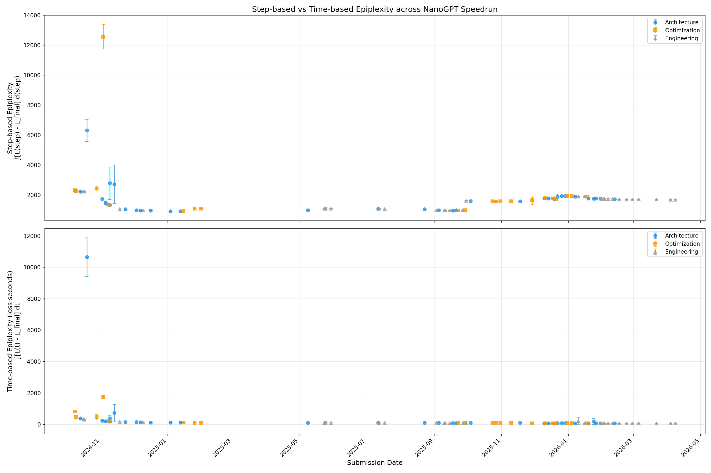
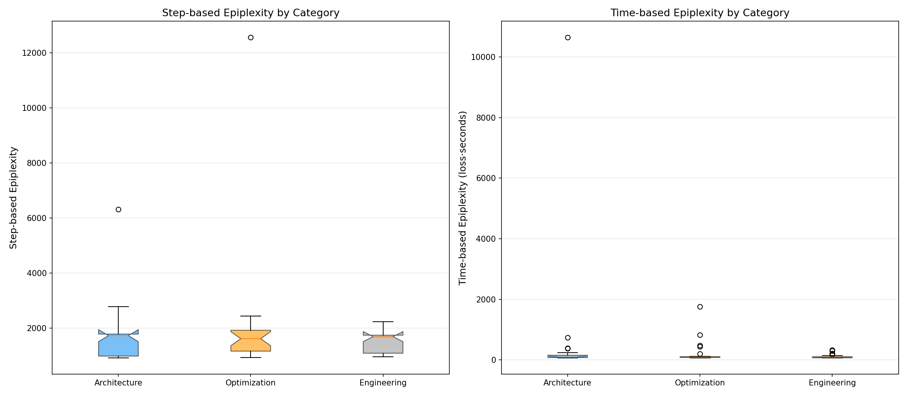
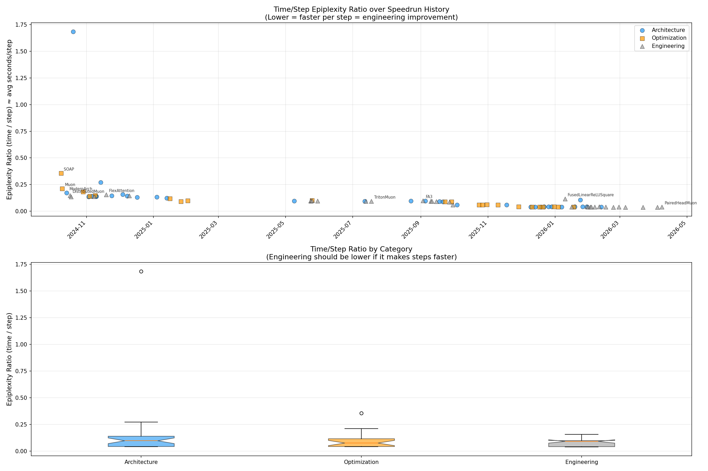
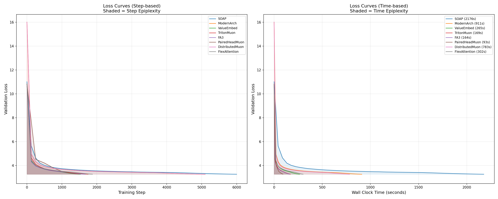
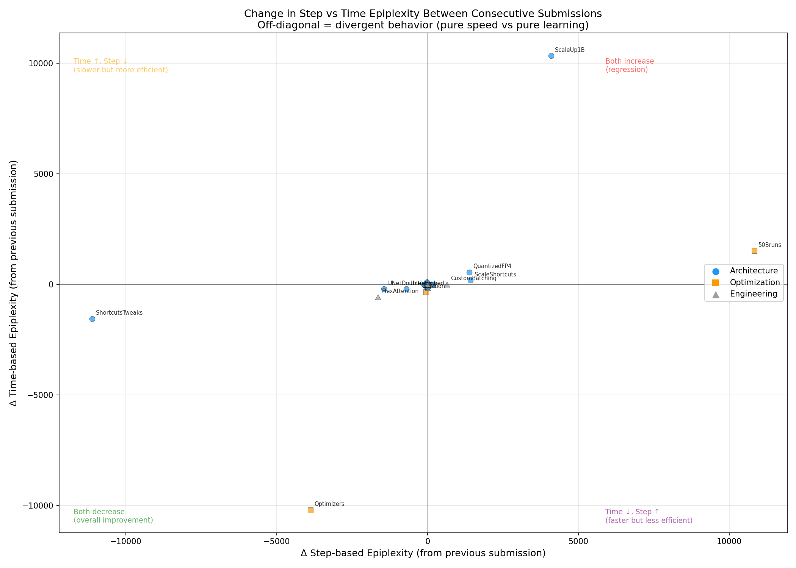
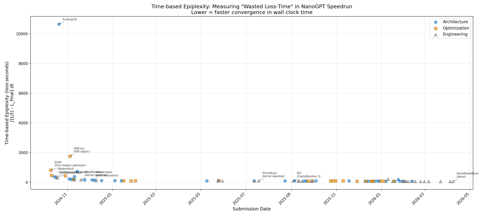

# Wall-Clock Time Epiplexity Analysis: Track 1

## Motivation

Track 1 of the modded-nanogpt speedrun has one goal: **reduce wall clock time** to reach 3.28 val loss on GPT-2 (124M). The original epiplexity analysis ([TRACK1_ANALYSIS.md](TRACK1_ANALYSIS.md)) used step number as the integration variable:

$$S_{\text{step}} = \int_0^{N} [L(s) - L_\infty] \, ds$$

But this is a **step-centric** view. A submission that trains for 1,500 steps in 90 seconds has the same step-epiplexity as one that trains for 1,500 steps in 300 seconds — yet the former is clearly better for the speedrun. Step-based epiplexity is blind to the speed improvements that are the entire point of Track 1.

**Time-based epiplexity** fixes this by integrating over wall clock time:

$$S_{\text{time}} = \int_0^{T} [L(t) - L_\infty] \, dt$$

where $t$ is wall clock time in seconds. This measures the total "wasted loss·time" — how much excess loss accumulates per second of actual compute. It naturally rewards both:
- **Faster convergence** (fewer seconds to reach target loss)
- **Better learning dynamics** (lower excess loss at each moment)

## Data

We parsed 87 out of 89 Track 1 submissions. Two early submissions (AdamW, llmc) use a legacy log format without `train_time` data and are excluded. For each log file, we extract `(step, val_loss, train_time_ms)` triplets from lines matching:
```
step:N/TOTAL val_loss:X.XXXX train_time:NNNms
```

Total runs parsed: 1,138 across 87 submissions.

## Key Results

### 1. Step-based and Time-based Epiplexity Tell Different Stories



**Step-based epiplexity** (top) shows the familiar pattern: a dramatic decrease in early submissions as step counts dropped from 6,000+ to ~1,500, then relative stability. The late-2025 step increase (to ~2,300 steps) creates an upward bump.

**Time-based epiplexity** (bottom) shows a much cleaner, more monotonic decline. It captures the full story: even when step counts increased in late 2025, submissions kept getting faster in wall clock time, so time-based epiplexity continued to drop.

The Pearson correlation between the two metrics is **r = 0.511** (p < 10⁻⁶) — they're correlated but far from identical. The 49% of variance NOT shared between them is exactly the "speed" dimension that time-based epiplexity captures.

### 2. Time-based Epiplexity Better Separates Categories



| Metric | Architecture (n=33) | Optimization (n=22) | Engineering (n=32) | Kruskal-Wallis p |
|---|---|---|---|---|
| **Step-based** | median=1,733 | median=1,623 | median=1,697 | **0.447** (not significant) |
| **Time-based** | median=96.3 | median=96.7 | median=90.8 | **0.131** (trending) |

Step-based epiplexity shows no significant difference between categories (p=0.447). Time-based epiplexity does better (p=0.131), with Architecture vs Engineering approaching significance (Mann-Whitney p=0.0615).

Why? Engineering submissions make individual steps faster without changing the loss curve shape. Step-based epiplexity is completely blind to this — two identical loss curves get the same step-epiplexity regardless of whether each step takes 60ms or 120ms. Time-based epiplexity captures this difference.

### 3. The Time/Step Ratio Reveals Pure Speed Improvements



The ratio $R = S_{\text{time}} / S_{\text{step}}$ is approximately the weighted-average time per step. Tracking this ratio over the speedrun's history reveals the **speed dimension** explicitly:

| Period | Representative | Ratio | Interpretation |
|---|---|---|---|
| Oct 2024 (early) | SOAP | 0.356 | ~356ms per step |
| Oct 2024 | Muon | 0.211 | Muon halved step time |
| Nov 2024 | UntieEmbed | 0.136 | Architecture + optimizer maturity |
| Jan 2025 | Sub3Min | 0.120 | Breaking the 3-minute barrier |
| May–Sep 2025 | Various | 0.088–0.098 | Kernel optimizations plateau |
| Oct–Dec 2025 | NorMuon era | 0.040–0.061 | Step count increase + massive speed gains |
| Jan–Apr 2026 | Latest | 0.037–0.042 | Approaching hardware limits |

The ratio dropped **~10×** over the speedrun (0.356 → 0.037), meaning each training step became 10× faster in wall clock time. This is the dimension that step-based epiplexity completely misses.

### 4. Loss Curves: Same Shape, Different X-Axis



When plotted against step number (left), many submissions have nearly identical loss curves — they reach the same loss at the same step. But when plotted against wall clock time (right), the curves compress dramatically as submissions get faster. The shaded areas (epiplexity) visually tell a different story in each view.

For example, SOAP and ModernArch have similar step-based loss curves (~2,200 step-epi), but ModernArch's curve is compressed in time (381s vs 825s time-epi) because each step runs faster. This is exactly the kind of improvement time-based epiplexity captures.

### 5. Delta Analysis: Speed vs Learning



For each consecutive pair of submissions, we plot Δ(step-epi) vs Δ(time-epi). Points on the diagonal mean both metrics changed proportionally. Off-diagonal points reveal divergent behavior:

- **Below the diagonal** (Δtime < Δstep proportionally): Submission made steps faster → Engineering improvement
- **Above the diagonal** (Δtime > Δstep proportionally): Submission changed learning dynamics more than speed → Architecture/Optimization change

Many Engineering submissions cluster near the bottom-left, confirming they improve speed more than learning efficiency.

### 6. The Full Timeline with Annotations



Time-based epiplexity provides a single number that captures the full "cost" of training — how many loss·seconds were wasted above the final converged value. The timeline shows a dramatic ~15× reduction from SOAP (825 loss·s) to the latest submissions (~65 loss·s).

## Detailed Comparison Table

| # | Date | Submission | Cat | Steps | Time(s) | StepEpi | TimeEpi | Ratio |
|---|---|---|---|---|---|---|---|---|
| 1 | 2024-10-09 | SOAP | Opt | 6,000 | 2,176 | 2,320 | 825.3 | 0.356 |
| 2 | 2024-10-10 | Muon | Opt | 6,200 | 1,339 | 2,276 | 479.6 | 0.211 |
| 3 | 2024-10-14 | ModernArch | Arc | 5,100 | 911 | 2,227 | 381.5 | 0.171 |
| 4 | 2024-10-17 | DistributedMuon | Eng | 5,100 | 783 | 2,237 | 330.7 | 0.148 |
| 5 | 2024-10-18 | PyTorch25 | Eng | 5,100 | 722 | 2,231 | 301.5 | 0.135 |
| 6 | 2024-10-20 | ScaleUp1B | Arc | 18,648 | 31,940 | 6,325 | 10,650 | 1.684 |
| 7 | 2024-10-29 | Optimizers | Opt | 5,100 | 968 | 2,439 | 446.9 | 0.183 |
| 8 | 2024-11-03 | UntieEmbed | Arc | 4,578 | 648 | 1,742 | 237.6 | 0.136 |
| 9 | 2024-11-04 | 50Bruns | Opt | 95,367 | 13,438 | 12,570 | 1,757 | 0.140 |
| 10 | 2024-11-06 | ShortcutsTweaks | Arc | 3,396 | 499 | 1,456 | 205.2 | 0.141 |
| ... | ... | ... | ... | ... | ... | ... | ... | ... |
| 85 | 2026-03-22 | VarlenMaxDocs | Eng | 1,490 | 87 | 1,703 | 64.5 | 0.038 |
| 86 | 2026-04-04 | FuseCEFwdAndBwd | Eng | 1,490 | 85 | 1,700 | 63.4 | 0.037 |
| 87 | 2026-04-08 | PairedHeadMuon | Eng | 1,482 | 93 | 1,695 | 68.1 | 0.040 |

(Full data in `wallclock_epiplexity.json`)

## Discussion

### Time-based Epiplexity is the Right Metric for Speed-Focused Competitions

For Track 1, where the goal is wall clock time reduction, time-based epiplexity is clearly more appropriate than step-based:

1. **It captures engineering contributions.** Step-based epiplexity gives ~1,700 to both FuseCEFwdAndBwd (85s) and UNetValueEmbedsTweaks (237s). Time-based epiplexity correctly scores them as 63.4 vs 137.9 — a 2× difference reflecting the actual wall-clock improvement.

2. **It resolves the step-count confound.** The step-based analysis in TRACK1_ANALYSIS.md identified step count as the dominant factor in epiplexity. Time-based epiplexity sidesteps this: it doesn't matter whether you train for 1,500 or 2,500 steps — what matters is how many loss·seconds you accumulate.

3. **It shows a cleaner trend.** The time-based timeline decreases monotonically (with rare exceptions), reflecting the steadily improving efficiency of the speedrun. Step-based epiplexity bounces up when step counts increase, obscuring the true progress.

### The Epiplexity Ratio as an Innovation Classifier

The ratio $R = S_{\text{time}} / S_{\text{step}}$ provides a clean signal for classification:

- **Engineering changes** reduce $R$ (same learning in less time)
- **Architecture/Optimization changes** reduce $S_{\text{step}}$ (better learning in same time-per-step)
- **The best submissions** reduce both

This decomposition — total improvement = learning efficiency × speed — is only visible when you have both metrics.

### Connecting to the Ideation Framework

The original ideation-epiplexity framework asks: does a change unlock new learnable structure, or just speed things up? With two epiplexity variants, we can be more precise:

| ΔS_step | ΔS_time | R change | Interpretation |
|---|---|---|---|
| ↓ large | ↓ large | ~same | **Ideation** — fundamentally better learning dynamics |
| ~same | ↓ large | ↓ | **Pure engineering** — same learning, faster execution |
| ↓ large | ↓ moderate | ↑ slightly | **Slower but smarter** — better learning at cost of speed |
| ~same | ~same | ~same | **Stagnation** |

This 2D view (step-epi × time-epi) is richer than either metric alone.

### Limitations

1. **Two submissions excluded** (AdamW, llmc) due to missing `train_time` in legacy format.
2. **Validation frequency varies** across submissions (every 125–250 steps), creating different temporal resolution for the trapezoidal integral.
3. **Time-based epiplexity depends on hardware.** All Track 1 submissions use 8×H100, so this is controlled, but the metric wouldn't be comparable across different hardware setups.
4. **The time-based metric conflates compilation/warmup overhead.** Some submissions include PyTorch compilation time in `train_time`, which inflates the first few steps disproportionately.
5. **FusedLinearReLUSquare and ImprovedLMHead** show anomalously high total_time (310s, 256s) compared to their neighbors (~105s), possibly due to compilation overhead or outlier runs.

## Files

- `wallclock_analysis.py` — Analysis script
- `wallclock_epiplexity.json` — Full JSON output
- `figures/wallclock_dual_timeline.png` — Step vs Time epiplexity timelines
- `figures/step_vs_time_epiplexity.png` — Scatter plot with correlation
- `figures/wallclock_category_comparison.png` — Box plots by category
- `figures/wallclock_ratio_analysis.png` — Time/Step ratio analysis
- `figures/wallclock_loss_curves.png` — Loss curves with step vs time x-axis
- `figures/wallclock_delta_analysis.png` — Consecutive submission deltas
- `figures/wallclock_normalized.png` — Normalized epiplexity per step/second
- `figures/wallclock_time_epi_annotated.png` — Annotated time-epi timeline
