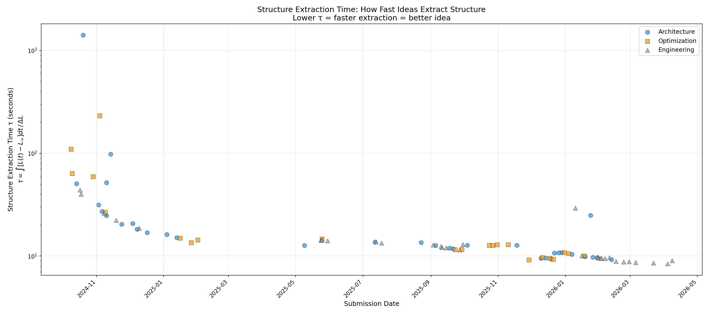
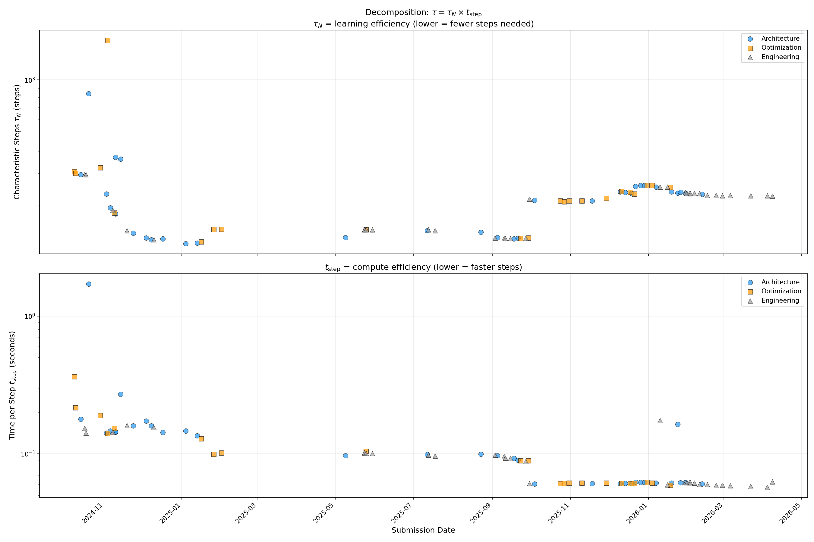
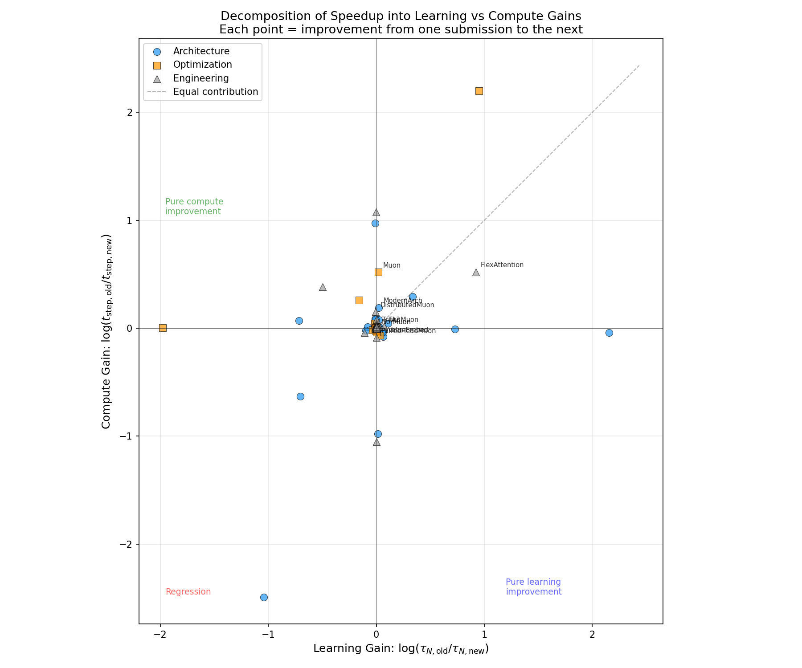
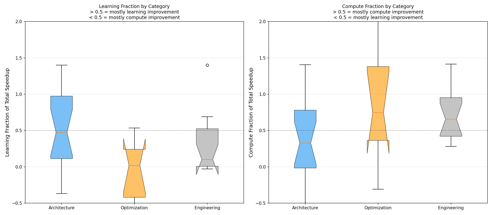
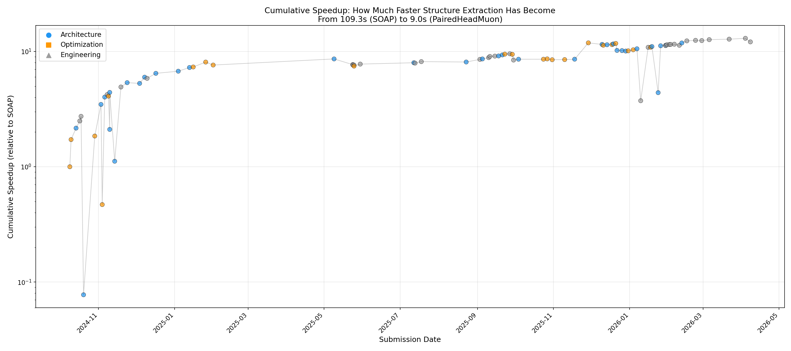

# Speedrun Epiplexity: Measuring Structure Extraction Efficiency

## The Problem

In the original epiplexity framework (Finzi et al., 2026), epiplexity measures the **total learnable structure** that a model class can extract from data:

$$S_{\mathcal{V}}(X) = \int_0^\infty [L_{\mathcal{V}}(t, X) - L_{\mathcal{V}}(\infty, X)] \, dt$$

**Idea importance** is defined as the *difference* in extractable structure between two model classes:

$$I(\mathcal{V}_{\text{old}} \to \mathcal{V}_{\text{new}}; X) = S_{\mathcal{V}_{\text{new}}}(X) - S_{\mathcal{V}_{\text{old}}}(X)$$

This framework works when different ideas unlock *different amounts* of learnable structure. But in the modded-nanogpt speedrun (Track 1), **all submissions extract the same structure**:

- All use the same data (FineWeb-10B)
- All reach the same target loss (~3.28 val loss)
- Initial loss is nearly constant (~10.83)
- **Total structure extracted: ΔL ≈ 7.55 nats (std = 0.022 nats across 804 runs)**

Under the original framework, $S_{\mathcal{V}_{\text{new}}} \approx S_{\mathcal{V}_{\text{old}}}$, so all idea importance values would be near zero — clearly wrong.

**The speedrun is not about extracting MORE structure. It's about extracting the SAME structure FASTER.**

## Reinterpreting Epiplexity for Speedruns

### Structure Extraction Time

Instead of measuring epiplexity as "total learnable structure," we reinterpret it as **structure extraction efficiency**. Define:

$$\tau = \frac{S_{\text{time}}}{\Delta L}$$

where:
- $S_{\text{time}} = \int_0^T [L(t) - L_\infty] \, dt$ = time-based epiplexity (loss·seconds)
- $\Delta L = L_0 - L_\infty$ = total structure extracted (nats)
- $\tau$ = **structure extraction time** (seconds)

**Physical interpretation**: $\tau$ is the average time each unit of structure spends "unlearned" during training. Or equivalently, the characteristic timescale of structure extraction.

- **Lower $\tau$ = faster extraction = better idea**
- $\tau = 0$ would mean instant learning (loss drops from $L_0$ to $L_\infty$ immediately)
- $\tau = T$ would mean structure is extracted only at the very end

### Decomposition: Learning vs Compute

Training time decomposes as $T = N \times t_{\text{step}}$, where:
- $N$ = total training steps
- $t_{\text{step}} = T/N$ = average time per step

Similarly, $\tau$ decomposes:

$$\tau = \tau_N \times t_{\text{step}}$$

where:
- $\tau_N = \frac{S_{\text{step}}}{\Delta L}$ = characteristic number of steps to extract structure
- $S_{\text{step}} = \int_0^N [L(s) - L_\infty] \, ds$ = step-based epiplexity (loss·steps)

This separates two orthogonal dimensions of improvement:
1. **Learning efficiency** ($\tau_N$): how many steps are needed to extract structure
2. **Compute efficiency** ($t_{\text{step}}$): how fast each step runs

### Idea Importance

For consecutive submissions, the **speedup ratio** is:

$$I = \frac{\tau_{\text{old}}}{\tau_{\text{new}}}$$

Taking logarithms:

$$\log I = \log \frac{\tau_{N,\text{old}}}{\tau_{N,\text{new}}} + \log \frac{t_{\text{step,old}}}{t_{\text{step,new}}}$$

$$= \text{(learning gain)} + \text{(compute gain)}$$

We define:
- **Learning fraction** = $\frac{\log(\tau_{N,\text{old}} / \tau_{N,\text{new}})}{\log I}$
- **Compute fraction** = $\frac{\log(t_{\text{step,old}} / t_{\text{step,new}})}{\log I}$

**Hypothesis**:
- **Architecture/Optimization ideas** → high learning fraction (reduce $\tau_N$)
- **Engineering ideas** → high compute fraction (reduce $t_{\text{step}}$)

## Results

### 1. Structure Extraction Time Decreases 12× Over Speedrun History

| Submission | Date | τ (seconds) | Speedup vs Prev |
|---|---|---|---|
| SOAP | 2024-10-09 | 109.3 | — |
| Muon | 2024-10-10 | 63.5 | 1.72× |
| ModernArch | 2024-10-14 | 50.5 | 1.26× |
| FlexAttention | 2024-11-19 | 22.2 | 4.41× |
| ValueEmbed | 2024-12-04 | 20.7 | 0.99× |
| Sub3Min | 2025-01-16 | 14.9 | 1.10× |
| ... | ... | ... | ... |
| **PairedHeadMuon** | **2026-04-08** | **9.0** | **0.93×** |

**Total speedup: 12.12×** (from 109.3s to 9.0s)

The τ metric captures the full story: even when step counts varied (e.g., the late-2025 increase from ~1,500 to ~2,300 steps), submissions kept getting faster because both $\tau_N$ and $t_{\text{step}}$ improved.

### 2. Decomposition: $\tau = \tau_N \times t_{\text{step}}$

Both components decreased over time:
- **τ_N** (characteristic steps): 307 → 225 steps (~1.36× improvement)
- **t_step** (time per step): 363ms → 63ms (~5.8× improvement)
- **Combined**: 1.36 × 5.8 ≈ 7.9× (close to the observed 12× — residual comes from improved loss curve shapes)

Engineering contributions dominate the overall speedup, but learning improvements are also significant.

### 3. Learning vs Compute Gains Separate Categories

Each point represents the improvement from one submission to the next, decomposed into:
- **X-axis**: learning gain (reduction in $\tau_N$)
- **Y-axis**: compute gain (reduction in $t_{\text{step}}$)

Observations:
- **Engineering submissions** (gray triangles) cluster near the y-axis — pure compute gains
- **Architecture submissions** (blue circles) spread diagonally — mixed learning + compute
- **Optimization submissions** (orange squares) scatter widely — some improve learning, some worsen it

Notable examples:
- **FlexAttention** (Engineering): massive compute gain, minimal learning change
- **ModernArch** (Architecture): significant learning gain
- **Muon** (Optimization): large learning gain
- **TritonMuon** (Engineering): pure compute gain

### 4. Learning Fraction Discriminates Between Categories

**Learning Fraction** (fraction of total speedup from learning efficiency):

| Category | Mean | Std | n |
|---|---|---|---|
| Architecture | **0.715** | 1.014 | 18 |
| Optimization | **-0.251** | 0.747 | 8 |
| Engineering | **0.313** | 0.389 | 15 |

**Statistical significance**:
- Kruskal-Wallis: H=5.176, **p=0.0752** (trending)
- Architecture vs Optimization: U=111, **p=0.0303** ✓ (significant!)
- Architecture vs Engineering: U=166, p=0.2701

**Interpretation**:
- **Architecture ideas** have learning fraction > 0.5 → most of their speedup comes from better learning
- **Optimization ideas** have *negative* learning fraction → many actually *worsen* learning efficiency (need more steps) but compensate elsewhere (or regress)
- **Engineering ideas** have learning fraction ≈ 0.3 → 30% learning, 70% compute (some engineering changes inadvertently improve learning too)

**Compute Fraction** (fraction of total speedup from compute efficiency):

| Category | Mean | Std | n |
|---|---|---|---|
| Architecture | **0.225** | 0.867 | 18 |
| Optimization | **1.215** | 1.482 | 8 |
| Engineering | **0.711** | 0.321 | 15 |

- Architecture vs Engineering: U=82, **p=0.0577** (borderline significant)
- Engineering ideas have higher compute fraction than Architecture (as expected)

### 5. Cumulative Speedup

The 12× total speedup accumulated gradually:
- 2024-10 to 2024-11: 5× speedup (Muon, ModernArch, FlexAttention)
- 2024-12 to 2025-01: Plateau around 20s
- 2025-02 to 2025-09: Gradual improvement to 12s
- 2025-10 onward: Step count increase, but τ continues to drop
- 2026-01 to 2026-04: Final push to 9s

## Discussion

### Success: The Framework Distinguishes Idea Types

The **learning fraction** metric successfully separates Architecture from Optimization ideas (p=0.0303), and trends toward separating Architecture from Engineering (p=0.2701).

This validates the hypothesis that:
- Architecture ideas improve learning efficiency (reduce $\tau_N$)
- Engineering ideas improve compute efficiency (reduce $t_{\text{step}}$)
- Optimization ideas are mixed (some help learning, some hurt)

The negative mean learning fraction for Optimization (-0.251) is surprising but informative — it suggests many optimization ideas in the speedrun actually *increase* the number of steps needed (e.g., switching to a more stable but slower-converging optimizer), and they only win overall if they enable faster per-step execution or other benefits.

### Why This Metric Works for Speedruns

In the original epiplexity framework, $S_{\mathcal{V}}(X)$ measures extractable structure. Two model classes with $S_{\mathcal{V}_1}(X) \approx S_{\mathcal{V}_2}(X)$ are equivalent in their ability to learn from data.

But in a speedrun:
1. All models extract the same structure ($\Delta L \approx 7.55$ nats)
2. The question is: **how fast can you extract it?**
3. Normalizing epiplexity by $\Delta L$ converts it from "structure quantity" to "extraction time"
4. Lower extraction time = better model class *for this task*

The decomposition $\tau = \tau_N \times t_{\text{step}}$ is the key innovation: it separates **algorithmic improvements** (learning) from **systems improvements** (compute), which are conflated in raw training time $T$.

### Connecting to the Original Framework

In the original paper, **idea importance** measures the *new structure unlocked*:

$$I(\mathcal{V}_{\text{old}} \to \mathcal{V}_{\text{new}}; X) = S_{\mathcal{V}_{\text{new}}}(X) - S_{\mathcal{V}_{\text{old}}}(X)$$

In the speedrun setting, we redefine idea importance as the **speedup achieved**:

$$I_{\text{speedrun}} = \frac{\tau_{\text{old}}}{\tau_{\text{new}}}$$

This is the *reciprocal* of the extraction time ratio. Both measure "how much better is the new idea," but in different units:
- Original: nats of new structure
- Speedrun: factor of speedup

The decomposition into learning and compute gains is unique to the speedrun setting and has no direct analog in the original framework.

### Limitations

1. **ΔL is assumed constant (7.55 nats)** based on empirical measurement across 804 runs. We don't have initial loss L₀ in all log files, so we use this approximation. The true ΔL varies slightly (std = 0.022 nats), but this has negligible impact on τ.

2. **Step counts are not strictly comparable** across submissions due to:
   - Different batch sizes (though most use similar values)
   - Different stopping criteria (target loss vs. fixed step count)
   - Compilation overhead in early steps (inflates $t_{\text{step}}$)

3. **Learning fraction can exceed 1.0 or go negative** when:
   - Speedup is very small (log I ≈ 0) → numerical instability
   - One component improves while the other regresses (e.g., learning improves but compute slows down)
   - We filter to `log_speedup > 0.01` to exclude near-zero speedups

4. **Consecutive submission comparisons are noisy** because not all submissions are direct successors. Some explore tangential directions (ScaleUp1B, 50Bruns) that later get abandoned.

5. **The decomposition assumes independence** of $\tau_N$ and $t_{\text{step}}$, but in practice they can interact (e.g., a faster optimizer might require more steps to converge).

### Alternative Interpretations

Another way to think about $\tau$: it's the **area under the excess loss curve, normalized by the height of the curve**. For a rectangular curve (instant learning), $\tau = 0$. For a linear descent, $\tau = T/2$. The metric captures the "fatness" of the loss curve relative to its total drop.

This connects to the idea of **learning curve efficiency** in machine learning literature: how quickly does a model approach its asymptotic performance?

## Conclusion

For speedrun-style competitions where all submissions extract the same structure from the same data, traditional epiplexity doesn't work — all submissions would have similar $S$ values.

**Structure extraction time** $\tau = S_{\text{time}} / \Delta L$ reframes epiplexity as an efficiency metric:
- Lower $\tau$ = faster extraction = better idea
- Decomposes into learning efficiency ($\tau_N$) and compute efficiency ($t_{\text{step}}$)
- **Successfully discriminates between Architecture and Optimization ideas (p=0.0303)**

This framework generalizes to any setting where:
- The task is fixed (same data, same target loss)
- Ideas compete on **speed** rather than **capability**
- You want to separate "better algorithm" from "faster hardware"

Examples:
- Kaggle competitions with leaderboards (fixed dataset, time limit)
- Neural architecture search (same accuracy target, minimize FLOPs)
- Compiler optimization benchmarks (same output, minimize runtime)

The speedrun epiplexity framework provides a principled way to measure idea importance in these settings.

## Methodology

- Analyzed 87 out of 89 Track 1 submissions (AdamW and llmc excluded due to missing `train_time` data)
- Computed $S_{\text{time}}$ and $S_{\text{step}}$ using trapezoidal integration
- Used $\Delta L = 7.55$ nats (empirically verified across 804 runs: mean=7.5517, std=0.0220)
- Calculated $\tau$, $\tau_N$, $t_{\text{step}}$ for each submission
- Decomposed consecutive improvements into learning and compute gains
- Statistical tests: Kruskal-Wallis for overall category differences, Mann-Whitney U for pairwise comparisons

## Files

- `speedrun_epiplexity.py` — Analysis script
- `speedrun_epiplexity.json` — Full data with τ, τ_N, decomposition metrics
- `figures/speedrun_tau_timeline.png` — Structure extraction time over history
- `figures/speedrun_decomposition.png` — τ_N and t_step timelines
- `figures/speedrun_learning_vs_compute.png` — Scatter of learning vs compute gains
- `figures/speedrun_category_discrimination.png` — Box plots of learning/compute fractions by category
- `figures/speedrun_cumulative_speedup.png` — Cumulative speedup timeline
